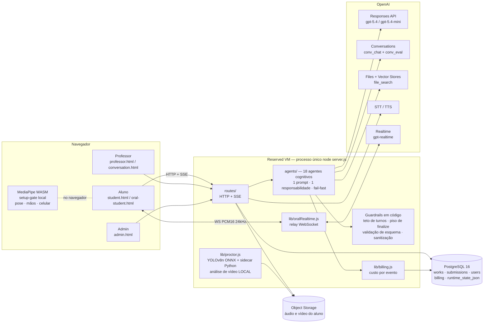
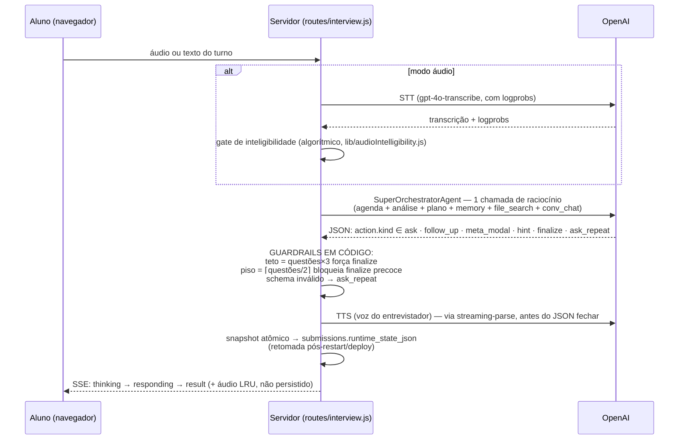
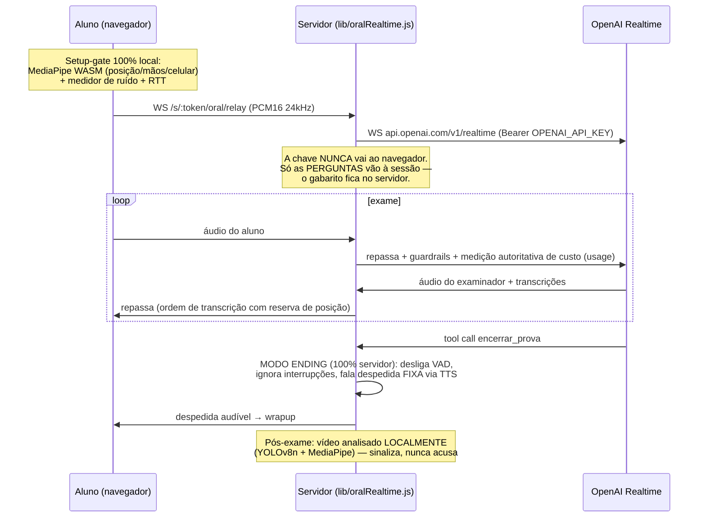
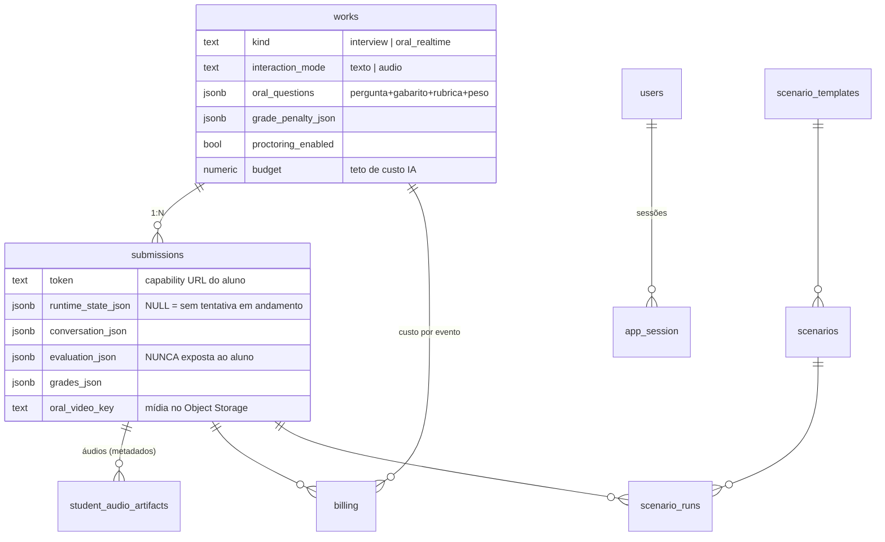
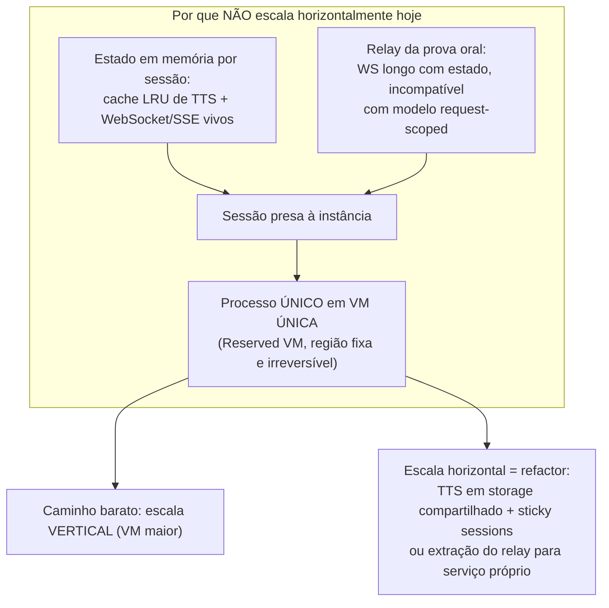

# ORATIA (super-ta) — Visão Técnica e Análise Crítica

> Sistema de avaliação de aprendizagem por **entrevista**: em vez de apenas corrigir o texto entregue, conversa com o aluno sobre o trabalho submetido para aferir **autoria, compreensão e coerência conceitual**. Três modalidades: entrevista de defesa (texto/voz, com fiscalização por vídeo opcional), prova oral em tempo real (voz contínua via Realtime) e cenários multi-interação (experimental).
>
> Este documento foi produzido confrontando a documentação arquitetural oficial (`Oratia-Arquitetura-v2.pdf`, v1.4, jul/2026) com o código real do repositório `super-ta/`. Onde há divergência, o código prevalece e a divergência é apontada. **As seções de segurança, escalabilidade, dependências e riscos são deliberadamente críticas.**
>
> **Este é o retrato de um momento — e o código andou desde então.** A fonte do
> **estado atual** de cada risco é a seção *Riscos abertos de escala e segurança*
> da skill `oratia-improve`, que carrega o estado verificado; aqui está a análise
> narrativa, com severidade e diagramas. Divergindo as duas, a skill manda e
> **este documento deve ser corrigido** — foi o que se fez em 31/08/2026 com as
> afirmações sobre papéis, fila de vídeo, chave da OpenAI e contagem de
> migrations, marcadas no texto onde deixaram de valer.

---

## Sumário

1. [Stack tecnológica](#1-stack-tecnológica)
2. [Arquitetura](#2-arquitetura)
3. [Componentes](#3-componentes)
4. [Comunicação](#4-comunicação)
5. [Segurança (análise crítica)](#5-segurança-análise-crítica)
6. [Escalabilidade (análise crítica)](#6-escalabilidade-análise-crítica)
7. [Dependências externas relevantes](#7-dependências-externas-relevantes)
8. [Riscos](#8-riscos)
9. [Perguntas norteadoras](#9-perguntas-norteadoras)
10. [Como testar: funcional e não-funcional](#10-como-testar-funcional-e-não-funcional)

---

## 1. Stack tecnológica

| Camada | Tecnologia | Observação |
|---|---|---|
| Runtime | **Node.js 20 (ESM)** — processo único `node server.js` | Monólito deliberado; sem cluster, sem fila externa |
| HTTP | **Express 4** + helmet + express-rate-limit | CSP **desligada** (débito); rate-limit só em `/login` |
| Frontend | **HTML/JS puro**, uma página por papel, **sem build/framework** | CDN para KaTeX/marked (motivo da CSP off) |
| Banco | **PostgreSQL 16** (79 migrations SQL forward-only, file-per-change) | Docker Compose em dev; acoplado ao deployment em prod |
| Sessões | express-session + connect-pg-simple (tabela `app_session`) | Cookie httpOnly, sameSite=lax |
| Senhas | bcrypt (custo 12) | |
| IA (nuvem) | **OpenAI**: Responses, Conversations, Files, Vector Stores, STT (`gpt-4o-transcribe`), TTS (`gpt-4o-mini-tts`), **Realtime** (`gpt-realtime-2.1`) | Modelos principais: `gpt-5.4` (effort high) e `gpt-5.4-mini` — centralizados em `config/policy.yaml` |
| IA (local) | **YOLOv8n** (ONNX, CPU, lazy-load) + **MediaPipe** (sidecar Python no servidor; Tasks WASM no navegador) | Proctoring pós-exame e setup-gate client-side |
| Tempo real | `ws` (relay WebSocket da prova oral) + SSE (streaming de turnos) | |
| Storage de mídia | Adaptador próprio `lib/audioStore.js`: backend `local` (filesystem) ou `replit` (Object Storage) | Extensível a S3/R2/GCS |
| Infra de produção | **Replit Reserved VM** (processo único, região fixa) + Publish manual | Sem CI/CD, sem staging (recomendado no doc oficial) |
| Testes | Unitários (node:test), E2E Playwright (áudio), E2E HTTP (texto), E2E Realtime (oral), juiz-LLM, benchmark de modelos | Sem CI que os execute |

---

## 2. Arquitetura

### 2.1 Visão de alto nível

Monólito Node.js entre o navegador e três dependências: OpenAI (cognição), PostgreSQL (estado durável) e Object Storage (mídia). Visão computacional roda **local** (servidor e navegador) — vídeo do aluno **nunca** vai à OpenAI.



### 2.2 Ciclo de um turno da entrevista

Padrão central — **carga cognitiva no modelo, controle no código**: UMA chamada de raciocínio por turno devolve uma ação em JSON; o código é um despachante com guardrails rígidos.



### 2.3 Prova oral — relay WebSocket (não WebRTC)

Decisão estruturante: o servidor fica **no meio** do áudio. Consequência direta: exige processo único persistente (Reserved VM) e **impede autoscale** sem refactor.



### 2.4 Modelo de dados (essência)



**Invariante central:** `runtime_state_json IS NULL` ⇔ nenhuma tentativa em andamento; quando presente, é o snapshot atômico que permite retomar a entrevista após restart/deploy. Mídia nunca no banco — Object Storage com metadados no banco.

---

## 3. Componentes

| Componente | Onde | Responsabilidade |
|---|---|---|
| **Rotas HTTP** | `routes/` (10 arquivos) | Por público: aluno (`interview.js`, `scenarioStudent.js`), professor (`work.js`, `oralExam.js`, `scenarioCockpit.js`), admin (`admin.js`, `benchmark.js`), estúdio (`scenarios.js`), páginas (`static.js`), diag |
| **18 agentes cognitivos** | `agents/` | Um prompt + uma responsabilidade cada: preparação (PrepBuilder), introdução, **SuperOrchestrator** (1 chamada/turno), avaliação (InterviewEvaluator, OralExamEvaluator, ScenarioEvaluator), notas (Grading), devolutiva sanitizada (StudentFeedback), penalidade (GradePenalty), extração de gabarito, rubricas (OralRubricBuilder), calibração, assistentes de config, cenários (4). Todos via Responses API, fail-fast, com preâmbulo anti-injection |
| **Infra compartilhada** | `lib/` | `db/` (Postgres), `sessionLifecycle` (rehidratação), `audio` (STT/TTS + LRU), `audioStore` (adaptador local/replit), `billing` (custo por evento), `oralRealtime` (relay), `proctor` (visão local), `rubric` (média ponderada em código), `superOrchestrator/actionSchema` (guardrails de esquema), `agentPreamble` (fronteira de confiança), `agentRun#runStructured`, `concurrency#mapPool`, `bench/` (benchmark de modelos) |
| **Config de runtime** | `config/` | `policy.yaml` (**fonte única de modelos** + gates), `pricing.yaml`, personas YAML (`interviewers/`), templates de prompt `.txt`, `voices.js`, `benchmark.yaml` |
| **Frontend** | `static/` | 1 página HTML por papel; `static/vision/` = MediaPipe Tasks WASM auto-hospedado (roda no navegador do aluno) |
| **Migrations** | `migrations/` | 79 arquivos SQL numerados, forward-only, aplicados **só por CLI** (`npm run db:migrate`) — nunca no boot |
| **Sidecar Python** | `scripts/proctor_hands.py` | MediaPipe Hands sobre frames (ffmpeg); isolado do Node via child_process |
| **Harnesses** | `tests/`, `scripts/`, `bench/` | Ver [seção 10](#10-como-testar-funcional-e-não-funcional) |

> **Divergências código × PDF (jul/2026):** o PDF cita 41 migrations — são **44** (042–044 = subsistema de benchmark, que o PDF chama de "em construção" mas está **entregue**: `lib/bench/`, `npm run bench`, consenso multi-juiz, testes estatísticos). Os harnesses `tests/cost-estimate` e `voice-cost` citados no PDF **não existem** com esses nomes. O modelo de trabalho tem **três** agentes de IA (Replit, Claude, Codex), não dois.

---

## 4. Comunicação

| Canal | Uso | Detalhe |
|---|---|---|
| **HTTP/JSON** | Toda a API | Body global 2 MB; overrides por rota (8kb–256kb); uploads via multer (PDF 20–25 MB, áudio 10–15 MB, vídeo 200–300 MB — vídeo da prova oral vai a disco, o resto memória) |
| **SSE** | Turnos em modo áudio e cenários | `thinking → responding → result`; primeira sílaba de TTS antes do JSON do orquestrador fechar (streaming-parse) |
| **WebSocket** | Relay da prova oral | navegador ↔ servidor ↔ OpenAI, PCM16 24 kHz; porta 443 (funciona atrás de rede corporativa) |
| **Dualidade de conversas** | OpenAI Conversations | `conv_chat` (visível ao aluno) × `conv_eval` (trilha de auditoria do professor). Avaliação interna nunca chega ao aluno; gabarito nunca chega ao navegador |
| **Autenticação** | 2 esquemas coexistem | **Sessão** (admin, benchmark, estúdio de cenários) e **capability URLs** — token hex de 12 chars (48 bits) para professor (`/w/:t`) e aluno (`/s/:t`) |
| **Sem CORS** | — | Same-origin por omissão; não há tokens anti-CSRF (mitigado por sameSite=lax nas rotas de sessão; rotas de token não usam cookie) |

---

## 5. Segurança (análise crítica)

### O que está bem resolvido

- **Segregação de segredos cognitivos**: gabarito nunca vai ao navegador (só perguntas entram na sessão Realtime — `lib/oralRealtime.js#buildExamInstructions`); avaliação interna nunca é exposta ao aluno; a chave OpenAI nunca sai do servidor (razão do relay WebSocket).
- **Defesa explícita contra prompt injection indireto**: `lib/agentPreamble.js` estabelece uma "fronteira de confiança" em todo agente — trechos de PDFs e retornos de `file_search` são **dado, não instrução**; padrões como "ignore as instruções anteriores", "system:", `<|im_start|>` são tratados como conteúdo. Isso é melhor do que o próprio PDF oficial declara (ele lista prompt injection como risco sem mitigação).
- **Dupla sanitização da devolutiva**: regra inviolável no prompt **+** varredura `FORBIDDEN_PATTERNS` em código (`StudentFeedbackAgent`) com retry e falha final — o sistema prefere não publicar a publicar acusação.
- **SQL parametrizado** de forma consistente; interpolações dinâmicas vêm de allowlists de código, não de input.
- **XSS**: padrão dominante de `escapeHtml` nos ~147 usos de `innerHTML` com dados de aluno.
- bcrypt custo 12, sessões server-side no PG, anti session-fixation (`session.regenerate`), guardrails do orquestrador **em código** (não confiam no LLM).

### Vulnerabilidades e lacunas (em ordem de severidade)

1. **Cockpit do professor protegido só por capability URL.** `/w/:token/*` dá poder de professor (ver conversas, subir gabarito, publicar notas) a **qualquer portador do link** — token de 48 bits, **sem sessão, sem rate-limit de adivinhação, sem expiração, sem revogação**. Vazou por referer/histórico/print → escalada completa. Assimétrico com admin/benchmark (sessão). Aceito no piloto; **inaceitável em escala institucional** (frentes 2–3 do roadmap resolvem).
2. **Prompt injection: defendido por prompt, não testado.** A fronteira de confiança existe, mas é uma instrução ao modelo — não há camada determinística (ex.: scanner de padrões no texto extraído dos PDFs antes de entrar no contexto) nem **bateria formal de red team** (frente 8 do roadmap). O vetor mais relevante segue sendo o PDF adversarial do aluno tentando manipular avaliador/entrevistador para inflar nota. Diagnóstico interno já mostrou fragilidade comportamental (entrevistador facilita sob insistência).
3. **CSP desligada** (`helmet({contentSecurityPolicy:false})`) por dependência de CDN (KaTeX/marked) + scripts inline. Remove a rede de proteção contra qualquer XSS que escape do escaping manual. Correção barata: auto-hospedar as libs e religar CSP.
4. ~~**Sem roles**: todo usuário logado é admin.~~ **CORRIGIDO NO CÓDIGO** (verificado em 31/08/2026): as migrations 055–069 criaram 16 tabelas da camada institucional, com `roles` trazendo quatro papéis (`admin_global`, `admin_unidade`, `professor`, `aluno`), `memberships` e RBAC decidindo de fato — criar trabalho sem unidade exige `admin_global`. A afirmação original valia quando este documento foi escrito e **deixou de valer**.
5. **Rate-limit só em `/login`**: endpoints de token (inclusive os que geram custo de IA) não têm limitação de taxa própria — abuso de custo e enumeração de token ficam sem freio (o orçamento por trabalho é o único teto).
6. **Uploads sem verificação antimalware nem `fileFilter` central** (validação de tipo ad-hoc por handler); vídeos de até 300 MB.
7. **LGPD**: áudio/vídeo de menores potencialmente; há GC de retenção (180 dias) e auto-acesso, mas **falta política formal de retenção/eliminação e trilha de auditoria de acesso**; consentimento existe (termo + gesto "CIENTE"), mas a fiscalização por vídeo amplia a coleta.
8. **`SESSION_SECRET` com fallback aleatório por boot** se a env faltar — não vaza, mas derruba todas as sessões a cada restart silenciosamente.
9. **Observabilidade de segurança**: logs locais ao processo, sem centralização/alertas — detecção de abuso é reativa.

---

## 6. Escalabilidade (análise crítica)

### Desenho atual e seu limite

Escala **piloto** comprovada (28 trabalhos, 128 submissões, 2 provas orais). O desenho é honesto sobre isso — mas os limites são estruturais:



### Gargalos em ordem de severidade

1. **Processo único / VM única** — sem réplicas; o teto é a VM. O acoplamento é o estado em memória (deliberado, mas não modularizado para extração).
2. **Custo e latência lineares por turno** — cada turno = 1 chamada `gpt-5.4` effort **high**. Turma inteira simultânea = pico linear de custo e fila. Não há teste de carga realizado (frente 11).
3. **Uma chave OpenAI para o caminho de sessão** — lote de avaliações do professor compete com entrevistas ao vivo pelos mesmos rate limits. **Parcialmente mitigado** (verificado em 31/08/2026): existe `OPENAI_API_KEY_BENCHMARK`, chave dedicada que isola o gasto dos trabalhos de benchmark, com fail-fast e sem fallback (`lib/openaiClient.js`, `lib/bench/adapters/openai.js`). Falta separação por ambiente e entre uso ao vivo × lote. A ressalva original de que a mitigação estava "ainda não feita" **deixou de valer em parte**.
4. **Proctoring na mesma VM** — ONNX em CPU + ffmpeg + Python em lote junto com tráfego ao vivo. **Parcialmente mitigado** (verificado em 31/08/2026): já existe fila — tabela `jobs` com a lane `video_analysis` e janela ociosa (`lib/proctorQueue.js`, migrations 078–079). Segue na mesma VM, porém: o `jobRunner` declara que "o app é o próprio worker". A ressalva original de que "não existe fila no sistema" **deixou de valer**.
5. **Onboarding por sessão** — cada submissão cria Vector Store + sobe 2 PDFs na OpenAI: latência e ponto de falha externo na entrada; em massa, gargalo.
6. **Operações em lote seguram HTTP longo** (progresso via streaming) — em turmas grandes precisa de fila com progresso persistido.
7. **Região única e permanente** — a prova oral por voz é sensível à perna longa navegador→servidor→OpenAI.

### O que JÁ ajuda

Setup-gate de visão roda no **navegador do aluno** (zero carga de detecção por aluno no servidor); snapshot por turno permite deploy sem derrubar entrevistas; billing por evento com orçamento por trabalho é um freio real de custo; `mapPool` limita concorrência de lotes.

**Veredito:** modularização *lógica* é boa (rotas/agentes/lib bem separados, storage já tem adaptador multi-backend), mas a modularização *operacional* não existe — nada foi desenhado para rodar em mais de um processo. Escalar de forma sustentável exige: (a) extrair proctoring para worker, (b) extrair ou tornar sticky o relay, (c) mover cache TTS para storage compartilhado ou aceitar sticky sessions, (d) fila para lotes. Nenhum desses é trivial, nenhum é impossível.

---

## 7. Dependências externas relevantes

| Dependência | Grau de acoplamento | Análise crítica |
|---|---|---|
| **OpenAI** | **ALTO — estrutural** | Não é "chamar um LLM": **Conversations** (histórico server-side), **Vector Stores/file_search** (RAG gerenciado), **Realtime** (prova oral) e STT/TTS são *recursos de plataforma* sem equivalente direto em outros fornecedores. O wrapper único (`lib/openaiClient.js`) e o `policy.yaml` centralizam a *seleção de modelo*, não a *API* — trocar de fornecedor = reconstruir a camada cognitiva. Ver [pergunta 2](#9-perguntas-norteadoras). |
| **Replit** | **MÉDIO — operacional** | Deploy (Publish com diff de schema — mecanismo **proprietário e opaco**: prod não tem ledger de migrations confiável), secrets, checkpoints, Object Storage. Mitigado: storage tem backend local; banco é PG padrão; app roda fora do Replit (comprovado pelo dev local). O risco real é o **processo de deploy**, não o runtime. |
| **GitHub** | BAIXO | Git padrão. |
| `openai` (npm ^6) | Alto | Cliente único de tudo acima. |
| `onnxruntime-node` | Baixo | Binário nativo; lazy-load faz a falta dele não quebrar o boot (bom). |
| MediaPipe (WASM + Python) | Baixo | Auto-hospedado; sidecar Python isolado. |
| `@replit/object-storage` | Baixo | Atrás de adaptador com backend local e receita para S3-like. |
| bcrypt, pg, ws, express, multer… | Baixo | Maduras, substituíveis. |
| **ffmpeg** (binário de sistema) | Médio | Não versionado no `requirements.txt`/npm — dependência implícita do proctoring (vem do `replit.nix` em prod). |

---

## 8. Riscos

| # | Risco | Prob. | Impacto | Mitigação atual | Ação recomendada |
|---|---|---|---|---|---|
| 1 | **Fornecedor único de cognição (OpenAI)**: mudança de preço/política/descontinuação de API (Conversations/Realtime são as mais expostas) | Média | **Crítico** | Wrapper + policy.yaml (só p/ modelo); benchmark de modelos | Camada de abstração por *capacidade* (ver §9.2); benchmark já existe — estender a modelos de outros fornecedores |
| 2 | **Prompt injection via PDF adversarial** inflando/afetando avaliação | Média | Alto | Preâmbulo de fronteira de confiança; guardrails em código | Bateria formal de red team (frente 8); scanner determinístico pré-contexto; testes adversariais em CI |
| 3 | **Capability URLs como única credencial** do professor | Média | Alto | Token aleatório 48 bits | Login federado + roles (frentes 2–3); rate-limit e expiração de token já |
| 4 | **Deploy sem CI, sem staging, com diff de schema proprietário** — regressão vai a prod sem rede | Alta | Alto | Checkpoints/rollback do Replit; disciplina de migrations | CI mínima (unitários grátis) + staging (recomendação §16 do doc oficial) |
| 5 | **Pico de custo/latência com turmas simultâneas** (chamada high por turno) | Alta em escala | Médio | Orçamento por trabalho; billing por evento | Teste de carga (frente 11); chave separada p/ lotes; degradação p/ modelo mais barato sob fila |
| 6 | **VM única = ponto único de falha** (inclusive durante provas orais ao vivo) | Baixa | Alto | Snapshot p/ retomada de entrevista; watchdogs no relay | Plano de DR documentado; a retomada NÃO cobre a prova oral em andamento |
| 7 | **LGPD**: mídia de alunos sem política formal de retenção/auditoria de acesso | Média | Alto (legal) | GC 180d, auto-acesso, consentimento | Política formal + trilha de auditoria + DPO review |
| 8 | **XSS residual** com CSP desligada | Baixa | Médio | escapeHtml consistente | Auto-hospedar CDNs, religar CSP |
| 9 | **Bus factor / conhecimento tácito**: complexidade escondida (relay ending, rehidratação, gate de inteligibilidade, IDs estáveis) concentrada | Média | Médio | Docs vivos bons (replit.md, architecture.md, CLAUDE.md) | Manter a regra "mapa de prompts"; onboarding guiado |
| 10 | Divergências config latentes: `gpt-realtime-2.1` sem chave em `pricing.yaml` (realtime fora do `validatePricingCoverage`); `personas.js` → `Investor.yaml` vs arquivo `Startup Investor.yaml` | Certa (existem) | Baixo | — | Corrigir; incluir realtime na validação de cobertura de preço |

---

## 9. Perguntas norteadoras

### 9.1 Posso implantar em qualquer plataforma?

**Sim, com uma ressalva operacional.** O runtime é portátil: Node 20 + PostgreSQL padrão + storage com adaptador (local hoje; receita documentada para S3/R2/GCS/MinIO) + segredos por env. O dev local fora do Replit é suportado de fábrica (`docker-compose` + `.env.example` + `npm run dev`). Requisitos da plataforma-alvo: **processo único persistente** (o relay WebSocket exige — nada de serverless/autoscale request-scoped), ffmpeg + Python para o proctoring (opcional, fail-open), e disco/memória para uploads de vídeo.
A ressalva: **o processo de deploy é Replit-específico** (Publish com diff de schema, sem ledger em prod). Migrar de plataforma implica assumir as migrations SQL como mecanismo canônico também em produção — o que é na verdade uma *melhoria* (elimina o mecanismo opaco).

### 9.2 Sou dependente de modelos proprietários específicos? Há como contornar sem perder qualidade?

**Dependência em dois níveis, com respostas diferentes:**

- **Modelos** (nível raso): dependência baixa. Seleção 100% centralizada (`policy.yaml`), e o **benchmark contínuo já entregue** (qualidade × custo × latência, consenso multi-juiz, testes estatísticos) é exatamente a ferramenta para trocar modelo com dados — a troca gpt-5.5→gpt-5.4 já foi feita assim, sem perda de qualidade.
- **Plataforma OpenAI** (nível estrutural): dependência **alta**. Quatro recursos são de plataforma, não de modelo: *Conversations* (histórico server-side), *Vector Stores/file_search* (RAG gerenciado), *Realtime* (voz fala-a-fala) e STT/TTS integrados.

**Rota segura de contorno, por ordem de esforço/risco:**
1. **Conversations** — substituível com risco baixo: o histórico já é persistido no banco (`conversation_json`); passar a montar o contexto localmente (o CLAUDE.md já recomenda estado local para contexto curto). É o desacoplamento mais barato.
2. **Vector Store/file_search** — substituível por RAG próprio (pgvector no Postgres já existente + embeddings de qualquer fornecedor). Esforço moderado; qualidade controlável por avaliação com o próprio benchmark.
3. **STT/TTS** — mercado maduro multi-fornecedor (inclusive open-source: Whisper). Atenção ao gate de inteligibilidade, calibrado sobre **logprobs do `gpt-4o-transcribe`** — trocar STT exige recalibrar.
4. **Responses/raciocínio** — qualquer fornecedor de fronteira serve *tecnicamente*; o risco é de **qualidade pedagógica**, e a resposta certa é rodar o benchmark contra o candidato antes de qualquer troca (a infraestrutura para isso já existe; falta só adicionar adapters de outros fornecedores).
5. **Realtime** — o mais difícil: fala-a-fala com tool-calling e VAD é oferta rara. Alternativa arquitetural já dominada pelo projeto: compor STT+LLM+TTS em streaming (latência maior). Deixar por último.

**Conclusão:** não há prisão irreversível, mas o contorno é um projeto (semanas, não dias), e a ordem acima minimiza risco. O princípio "análise sempre em texto" é o maior aliado — nenhuma decisão pedagógica depende de recurso proprietário de áudio.

### 9.3 Posso escalar? Está devidamente modularizado para escalar de forma sustentável?

**Verticalmente, sim — horizontalmente, não sem refactor** (detalhes na [seção 6](#6-escalabilidade-análise-crítica)). A modularização *lógica* é boa (rotas/agentes/lib, adaptador de storage, billing por evento); a *operacional* não existe: cache TTS em memória, conexões vivas e relay prendem tudo a um processo. A sequência sustentável: worker de proctoring → fila para lotes → sticky sessions ou extração do relay → réplicas. Antes de qualquer uma: **teste de carga em staging** (não existe hoje; recomendação explícita do doc oficial, frentes 11 e 16).

### 9.4 Está amplamente protegido contra prompt injection? Quais os pontos de vulnerabilidade?

**Parcialmente protegido — acima do declarado, abaixo do necessário.** Existe defesa real e sistemática (fronteira de confiança em `lib/agentPreamble.js`, aplicada a todos os agentes; guardrails de fluxo em código que limitam o que uma injeção conseguiria fazer; dupla sanitização da devolutiva; separação gabarito/aluno). Mas é defesa **por instrução ao modelo**, sem camada determinística e **sem verificação adversarial sistemática**.

Pontos de vulnerabilidade, do mais ao menos exposto:
1. **PDF do aluno** (o vetor nº 1): entra no `file_search` e na análise do PrepBuilder; alvo: inflar avaliação/nota ou desviar o entrevistador. Impacto direto em nota.
2. **Conversa do aluno** (injeção direta): guardrails limitam ações possíveis, mas fragilidade comportamental já diagnosticada (facilitação sob insistência).
3. **Enunciado do professor** (menos adversarial, mesma via técnica).
4. **Campos de config do professor** (persona, política de penalidade, prompt de devolutiva): entram em prompts; um professor malicioso/comprometido influencia seus próprios alunos.
5. **Transcrição da prova oral** → avaliador (o aluno pode *falar* uma injeção; o OralExamEvaluator a lê como texto).

O que falta (frente 8 do roadmap): bateria de red team automatizada (PDFs e diálogos adversariais como harness reproduzível), scanner determinístico pré-contexto, e monitoramento de anomalias de avaliação (nota alta com evidência fraca).

### 9.5 Como testar de forma eficiente: funcional e não-funcional?

Ver seção seguinte — o princípio é **pirâmide de custo**: tudo que é grátis roda sempre; o que gasta API roda com teto e propósito.

---

## 10. Como testar: funcional e não-funcional

### Funcional (pirâmide de custo)

| Nível | Harness | Custo | Quando rodar |
|---|---|---|---|
| **Unitários** (parser de streaming, rubrica, upload, chunks de áudio, YAML de cenários) | `node tests/unit-*.mjs` · `node --test tests/*.test.mjs` | **Zero** (sem LLM, sem banco) | Sempre; candidatos imediatos a CI |
| **Smoke local** | subir via skill `oratia-local-deploy` + fluxo mínimo (criar trabalho → upload → 2 turnos) | Centavos | A cada mudança relevante |
| **E2E texto** | `tests/text-e2e-mineracao.mjs` (princípio "resposta de cabeça") · `text-e2e-adversarial.mjs` (A/B sob pressão do aluno) | Gasta API | Mudanças de prompt/orquestração |
| **E2E áudio** | `npm run test:audio` (Chrome + mic falso + aluno-LLM; salva mp3 p/ auditoria) — skill `testar-modo-audio` | Gasta API | Mudanças na cadeia STT/TTS/SSE |
| **E2E prova oral** | `RUN_ORAL_E2E=1 node tests/oral-e2e/run.mjs` (~US$0,09) · `oral-ending-e2e.mjs` (a prova TERMINA com fala) | Baixo, opt-in | Mudanças no relay/ending |
| **Qualidade por juiz-LLM** | `tests/scenario-eval.mjs --max-usd N` (único com **teto duro**) · `npm run test:ab-orchestrator` (forte × rápido, juiz cego) | Gasta API, com cap | Antes de trocar modelo/prompt central |
| **Forense** | `npm run analyze:authorship` | Gasta API | Sob demanda do professor |

### Não-funcional (o que falta e como fazer com eficiência)

1. **Carga**: não existe hoje. Fazer em **staging** (clone da Reserved VM, chave OpenAI separada, dados sintéticos — receita pronta na §16 do doc oficial) com **modo mock das respostas OpenAI** para medir o *servidor* sem custo por requisição; carga "real" com IA só em amostra pequena. Cenários prioritários: N entrevistas simultâneas (pico de turma), lote de avaliação concorrendo com entrevistas ao vivo, proctoring em lote sob tráfego.
2. **Segurança**: red team de IA como harness reproduzível (corpus de PDFs adversariais + diálogos de injeção, julgados por juiz-LLM + asserções determinísticas — a infra de juiz já existe em `scenario-eval`); convencional: fuzzing de uploads, enumeração de tokens, verificação de rate limits.
3. **Latência/custo por turno**: `scripts/analyze-audio-pacing.mjs` (já existe, lê o banco) + a tabela `billing` como fonte de verdade — transformar em dashboard (frente 9).
4. **Regressão contínua**: hoje **não há CI**. Mínimo viável imediato e grátis: GitHub Actions rodando unitários + `npm run bench:validate` (dry-run) + lint de migrations (numeração). Os E2E pagos ficam manuais/agendados com cap.

---

## Apêndice — mapa do repositório

```
super-ta/
├── server.js            # boot: helmet, sessão, rotas, relay WS; SEM migrations no boot
├── auth.js              # login bcrypt + sessões PG + seeds
├── routes/              # endpoints por público (aluno/professor/admin/oral/cenários/benchmark)
├── agents/              # 18 agentes cognitivos (Responses API, fail-fast, preâmbulo anti-injection)
├── lib/                 # db, sessão, áudio, billing, relay, proctor, rubrica, guardrails, bench
├── config/              # policy.yaml (fonte única de modelos), pricing.yaml, personas, templates
├── migrations/          # 79 SQL forward-only, file-per-change, aplicadas só por CLI
├── static/              # 1 HTML por papel, sem build; static/vision = MediaPipe WASM
├── models/              # YOLOv8n (.onnx) + MediaPipe (.task) — visão local
├── scripts/             # migrate, start-db, audio-gc, detect-ai-answers, proctor_hands.py, bench-run
├── tests/               # unitários grátis + E2E (áudio/texto/oral) + juiz-LLM + benchmark
├── bench/cases/         # 5 casos seed do benchmark de modelos
└── docs/                # architecture.md (mapa de prompts), super-orchestrator-plan.md, benchmark
```

**Skills disponíveis neste workspace:** `oratia-improve` (evoluir a aplicação conforme a proposta declarada), `oratia-local-deploy` (subir ambiente local via Docker), `testar-modo-audio` (E2E de voz).

*Documento gerado em jul/2026 a partir do confronto entre `Oratia-Arquitetura-v2.pdf` (v1.4) e o código-fonte em `super-ta/` (main, ~44 migrations). Divergências apontadas no texto.*
