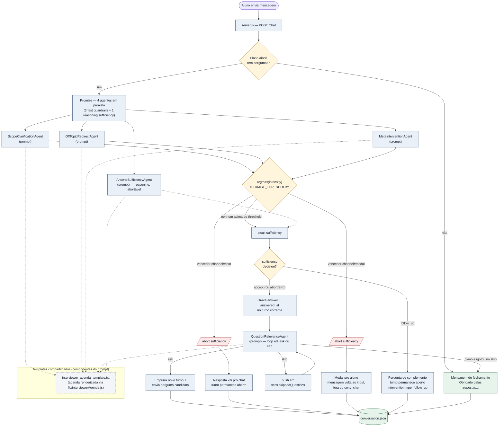

# Arquitetura — ciclo do `/chat` e mapa de prompts

Diagrama do que acontece entre uma resposta do aluno e a próxima pergunta do plano:
triagem em paralelo (3 agentes), agente de relevância (loop de skip) e progressão.

> **Como abrir os arquivos no clique**
>
> Pré-requisito: extensão **Markdown Preview Mermaid Support** (`bierner.markdown-mermaid`) instalada. Abra esta página com `Ctrl+Shift+V`.
>
> No diagrama, **cada nó de agente clica direto na linha do `systemPrompt`** (não no topo do arquivo). Os nós de fluxo clicam na linha do handler/função correspondente. O nó "Templates compartilhados" clica nos templates `.txt` que entram na composição dos prompts dos agentes de triagem e do de relevância. Se o seu preview bloquear o esquema `vscode://` (alguns o fazem por segurança), use a **tabela de navegação** abaixo do diagrama — links markdown puros que sempre funcionam.



## Tabela de navegação — código e prompt lado a lado

Use esta tabela se o clique no SVG não abrir nada. Cada linha tem o **bloco de código** e o **prompt** correspondente quando há.

| Bloco | Código | Prompt enviado à LLM |
|---|---|---|
| Handler do `/chat` | [server.js:975](../server.js#L975) | — |
| Lançamento dos 4 agentes em paralelo | [server.js:1010](../server.js#L1010) | — |
| `ScopeClarificationAgent` (fast) | [agents/ScopeClarificationAgent.js](../agents/ScopeClarificationAgent.js) | [systemPrompt :23](../agents/ScopeClarificationAgent.js#L23) + agenda + último turno |
| `OffTopicRedirectAgent` (fast) | [agents/OffTopicRedirectAgent.js](../agents/OffTopicRedirectAgent.js) | [systemPrompt :20](../agents/OffTopicRedirectAgent.js#L20) + agenda + último turno |
| `MetaInterventionAgent` (fast) | [agents/MetaInterventionAgent.js](../agents/MetaInterventionAgent.js) | [systemPrompt :24](../agents/MetaInterventionAgent.js#L24) + agenda + último turno |
| `AnswerSufficiencyAgent` (reasoning, abortável) | [agents/AnswerSufficiencyAgent.js](../agents/AnswerSufficiencyAgent.js) | [systemPrompt :33](../agents/AnswerSufficiencyAgent.js#L33) + agenda + pergunta do turno + conversa completa + última mensagem (RAG via vector store) |
| Decisão do vencedor (`pickTriageWinner`) | [server.js:273](../server.js#L273) | — |
| Abort do sufficiency em winner | [server.js:1057](../server.js#L1057) | — |
| Await do sufficiency e ramo follow_up | [server.js:1125](../server.js#L1125) | — |
| Gravação da answer no turno (ramo accept) | [server.js:1179](../server.js#L1179) | — |
| `QuestionRelevanceAgent` (fast) | [agents/QuestionRelevanceAgent.js](../agents/QuestionRelevanceAgent.js) | [systemPrompt :23](../agents/QuestionRelevanceAgent.js#L23) + agenda + conversa completa + candidata |
| Skip-loop de relevância | [server.js:1196](../server.js#L1196) | — |
| `turnFromPlanQuestion` | [server.js:187](../server.js#L187) | — |
| Serializer do log | [server.js:207](../server.js#L207) | — |
| Persistência do log | [lib/conversationLog.js](../lib/conversationLog.js) | — |
| Endpoint que serve o log pro professor | [server.js:592](../server.js#L592) | — |
| Mensagem de fechamento (sentinel) | [server.js:1244](../server.js#L1244) | string literal — não vai à LLM |

## Caminhos não cobertos pelo diagrama

| Bloco | Código | Prompt enviado à LLM |
|---|---|---|
| `/upload` (gera plano de entrevista) | [server.js:847](../server.js#L847) | [interview_prompt_template.txt](../config/interview_prompt_template.txt) renderizado via [lib/interviewPrompt.js](../lib/interviewPrompt.js) |
| `MapBuilderAgent` (chamado em `/upload`) | [agents/MapBuilderAgent.js](../agents/MapBuilderAgent.js) | [systemPrompt :22](../agents/MapBuilderAgent.js#L22) |
| `ComprehensionEvaluatorAgent` (chamado em `/finalize`) | [agents/ComprehensionEvaluatorAgent.js](../agents/ComprehensionEvaluatorAgent.js) | [systemPrompt :23](../agents/ComprehensionEvaluatorAgent.js#L23) |
| `ClarificationEvaluatorAgent` (chamado em `/finalize`) | [agents/ClarificationEvaluatorAgent.js](../agents/ClarificationEvaluatorAgent.js) | [systemPrompt :23](../agents/ClarificationEvaluatorAgent.js#L23) |
| `INTERVIEWER_ADAPT_INSTRUCTIONS` (botão "Adaptar ao enunciado") | [server.js:660](../server.js#L660) | string literal usada como `instructions` na chamada da Responses API |
| Base TA (carregada por `loadSystemPrompt`) | [server.js:88](../server.js#L88) | [config/system_prompt.txt](../config/system_prompt.txt) |
| `/finalize` (gera relatório) | [server.js:1192](../server.js#L1192) | strings inline na função `calculateRubricScores` (a ser extraídas, ver TODO abaixo) |

## Índice completo de prompts

Lugar único onde encontrar **todo prompt enviado à LLM** no sistema:

1. **Templates `.txt`** ([config/](../config/)):
   - [system_prompt.txt](../config/system_prompt.txt) — base TA.
   - [interview_prompt_template.txt](../config/interview_prompt_template.txt) — geração do plano de entrevista (em `/upload`).
   - [interviewer_agenda_template.txt](../config/interviewer_agenda_template.txt) — bloco de agenda compartilhado por triagem e relevância.
2. **`systemPrompt` em classes de agente** ([agents/](../agents/)):
   - [MapBuilderAgent.js#L22](../agents/MapBuilderAgent.js#L22) — modelo: `principal_reasoning_model`
   - [ComprehensionEvaluatorAgent.js#L23](../agents/ComprehensionEvaluatorAgent.js#L23) — modelo: `principal_reasoning_model`
   - [ClarificationEvaluatorAgent.js#L23](../agents/ClarificationEvaluatorAgent.js#L23) — modelo: `principal_reasoning_model`
   - [ScopeClarificationAgent.js#L23](../agents/ScopeClarificationAgent.js#L23) — modelo: `fast_model`
   - [OffTopicRedirectAgent.js#L20](../agents/OffTopicRedirectAgent.js#L20) — modelo: `fast_model`
   - [MetaInterventionAgent.js#L24](../agents/MetaInterventionAgent.js#L24) — modelo: `fast_model`
   - [QuestionRelevanceAgent.js#L23](../agents/QuestionRelevanceAgent.js#L23) — modelo: `fast_model`
   - [AnswerSufficiencyAgent.js#L33](../agents/AnswerSufficiencyAgent.js#L33) — modelo: `principal_reasoning_model` (abortável via `signal`)
3. **Strings inline em `server.js`**:
   - [INTERVIEWER_ADAPT_INSTRUCTIONS — linha 660](../server.js#L660) — instruções para "Adaptar ao enunciado".
   - **TODO**: as instruções de C2/C3 dentro de `calculateRubricScores` ainda são strings inline. Quando extraídas para um arquivo dedicado, atualizar este índice.

## Convenção do esquema `vscode://`

Formato no Windows:

```
vscode://file/<drive>:/<caminho-com-barras-pra-frente>:<linha>
```

Exemplo: `vscode://file/c:/Users/glads/src/super-ta/server.js:973`. Sem `:linha` no final, abre na linha 1.
