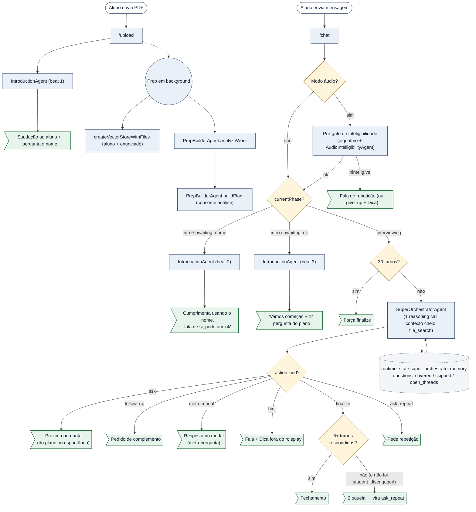
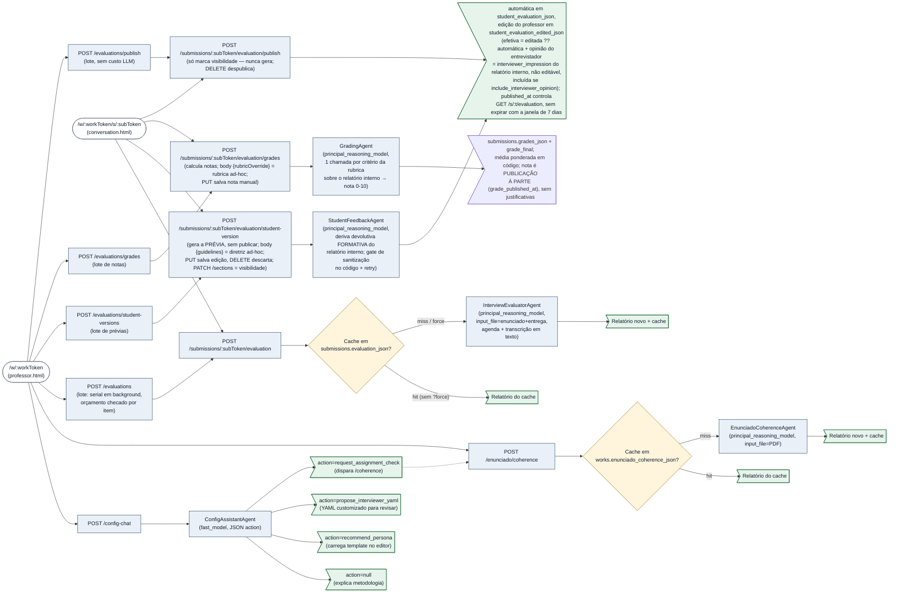
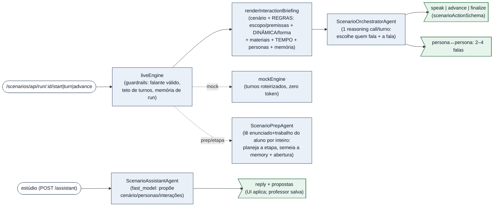

# Arquitetura — ciclo do `/chat` e mapa de prompts

Após a reforma do super-orquestrador (merge `dae5780`), o ciclo de uma resposta
do aluno ao próximo passo do entrevistador deixou de ter triagem×3 +
sufficiency + relevance em paralelo. Hoje, **uma única chamada de raciocínio
por turno** (SuperOrchestratorAgent) decide tudo: continuar, fazer follow-up,
abrir modal de meta-pergunta, mostrar dica, finalizar. O código vira
despachante; agente decide.

> **Como abrir os arquivos no clique**
>
> Pré-requisito: extensão **Markdown Preview Mermaid Support** (`bierner.markdown-mermaid`) instalada. Abra esta página com `Ctrl+Shift+V`.
>
> Os nós de agente clicam direto na linha do `systemPrompt` (não no topo do arquivo). Se o seu preview bloquear o esquema `vscode://` (alguns o fazem por segurança), use a **tabela de navegação** abaixo do diagrama.



## Tabela de navegação — código e prompt lado a lado

Use esta tabela se o clique no SVG não abrir nada. Cada linha tem o **bloco de código** e o **prompt** correspondente quando há.

| Bloco | Código | Prompt enviado à LLM |
|---|---|---|
| Handler do `/upload` | [routes/interview.js — /upload](../routes/interview.js) | — |
| Preparação em background (`startInterviewPreparation`) | [lib/sessionLifecycle.js — startInterviewPreparation](../lib/sessionLifecycle.js) | ver agentes correspondentes |
| `PrepBuilderAgent.analyzeWork` (1ª chamada da prep, analisa trabalho + enunciado) | [agents/PrepBuilderAgent.js — analyzeWork](../agents/PrepBuilderAgent.js) | preâmbulo (`orchestrator_only`) + `analyzeSystemBody` + agenda |
| `PrepBuilderAgent.buildPlan` (2ª chamada, recebe análise) | [agents/PrepBuilderAgent.js — buildPlan](../agents/PrepBuilderAgent.js) | preâmbulo (`orchestrator_only`) + [interview_prompt_template.txt](../config/interview_prompt_template.txt) renderizado + análise prévia |
| `createVectorStoreWithFiles` (aluno + enunciado, expandido na reforma) | [lib/sessionLifecycle.js:59](../lib/sessionLifecycle.js#L59) | — |
| Handler do `/chat` | [routes/interview.js — /chat](../routes/interview.js) | — |
| Pré-gate de inteligibilidade (algoritmo puro decide; `AudioIntelligibilityAgent` só fraseia) | [lib/audioIntelligibility.js](../lib/audioIntelligibility.js) + [agents/AudioIntelligibilityAgent.js](../agents/AudioIntelligibilityAgent.js) | preâmbulo + `systemPromptBody` + agenda + transcrição + trechos detectados |
| `IntroductionAgent` (3 beats: ask_name / present_self / begin) | [agents/IntroductionAgent.js](../agents/IntroductionAgent.js) | [bodyFor :39](../agents/IntroductionAgent.js#L39) + persona + agenda + histórico do intro |
| `SuperOrchestratorAgent` (UMA chamada por turno na fase interviewing) | [agents/SuperOrchestratorAgent.js](../agents/SuperOrchestratorAgent.js) | preâmbulo (`student_via_interviewer_voice`) + `systemPromptBody` + agenda + análise + plano + memory + histórico (via Conversations API) + última mensagem |
| Schema da ação do super-orquestrador | [lib/superOrchestrator/actionSchema.js](../lib/superOrchestrator/actionSchema.js) | descrição embutida no prompt do agente |
| Despachante por `action.kind` em `/chat` | [routes/interview.js — bloco SUPER-ORQUESTRADOR](../routes/interview.js) | — |
| Guardrails de cap e finalize precoce (derivados de `works.question_count`: cap = nº×3, piso = ⌈nº/2⌉) | [routes/interview.js — maxTurnsFor / minTurnsBeforeFinalizeFor](../routes/interview.js) | — |
| Sortição da persona | [lib/personas.js](../lib/personas.js) | — |
| `turnFromPlanQuestion` | [lib/conversationUtils.js](../lib/conversationUtils.js) | — |
| Persistência do log | [lib/conversationUtils.js — persistConversationLog](../lib/conversationUtils.js) | — |
| Endpoint que serve o log pro professor | [routes/work.js — /conversation](../routes/work.js) | — |
| SSE em `/chat` áudio interviewing (sinal `responding` em tempo real) | [routes/interview.js — useSSE / sendFinal](../routes/interview.js) + [agents/SuperOrchestratorAgent.js — onFirstDelta](../agents/SuperOrchestratorAgent.js) | — |

## Caminhos não cobertos pelo diagrama

| Bloco | Código | Prompt enviado à LLM |
|---|---|---|
| `INTERVIEWER_ADAPT_INSTRUCTIONS` (botão "Adaptar ao enunciado") | [config/interviewer_adapt_instructions.txt](../config/interviewer_adapt_instructions.txt), carregado por [routes/work.js](../routes/work.js) | template carregado uma vez e usado como `instructions` na chamada da Responses API |
| `ConfigAssistantAgent` (chat do assistente de configuração, em `/w/:workToken/config-chat`) | [agents/ConfigAssistantAgent.js](../agents/ConfigAssistantAgent.js) | preâmbulo + `systemPromptBody` |
| `EnunciadoCoherenceAgent` (avalia adequação do enunciado, em `/w/:workToken/enunciado/coherence`) | [agents/EnunciadoCoherenceAgent.js](../agents/EnunciadoCoherenceAgent.js) | preâmbulo + `systemPromptBody` |
| `InterviewEvaluatorAgent` (avalia a entrevista sob a perspectiva do entrevistador, em `/w/:workToken/submissions/:subToken/evaluation`) | [agents/InterviewEvaluatorAgent.js](../agents/InterviewEvaluatorAgent.js#L167) | preâmbulo (`professor_via_ui`) + `systemPromptBody` (inclui `EXTEMPORANEOUS_ANSWER_PRINCIPLE`) + agenda + transcrição serializada com métricas de forma/entrega por turno, incluindo tempo de pensamento por par pergunta-resposta ([lib/deliverySignals.js](../lib/deliverySignals.js), compartilhado com o forense `scripts/detect-ai-answers.mjs`); PDFs (enunciado + entrega) via `input_file` |
| `StudentFeedbackAgent` (deriva a devolutiva FORMATIVA ao aluno — PRÉVIA, sem publicar — em `/w/:workToken/submissions/:subToken/evaluation/student-version` e no lote `/w/:workToken/evaluations/student-versions`; publicar é passo separado em `/evaluation/publish`) | [agents/StudentFeedbackAgent.js](../agents/StudentFeedbackAgent.js#L101) | preâmbulo (`student_via_ui`) + `systemPromptBody` + diretrizes do professor (`works.feedback_guidelines` — tom/formato/ênfases E QUAIS ASPECTOS entram; professor soberano sobre o conteúdo: se pedir, comenta tempo/leitura/"de cabeça") + relatório interno como input; saída sanitizada por `FORBIDDEN_PATTERNS` no código (conjunto único de ACUSAÇÃO; regra inviolável = não imputar causa; vazou → retry → falha). NÃO depende de `works.expect_spontaneous` |
| `GradingAgent` (nota de UM critério da rubrica, em `/w/:workToken/submissions/:subToken/evaluation/grades` e no lote `/w/:workToken/evaluations/grades`) | [agents/GradingAgent.js](../agents/GradingAgent.js#L31) | preâmbulo (`professor_via_ui`) + `systemPromptBody` + o prompt do critério (definido pelo professor em `works.grading_rubric`) + relatório interno como input; 1 chamada por critério → `{score 0-10, justification}`; nota final = média ponderada em código ([lib/rubric.js](../lib/rubric.js)) |
| Retomada de sessão após restart (`/start`: hidrata do BD + valida recursos OpenAI + rebuild quando necessário) | [lib/sessionLifecycle.js — initOrResumeSession / validateResources / rebuildSession](../lib/sessionLifecycle.js), [lib/sessionState.js](../lib/sessionState.js) | nenhum LLM novo — rebuild reusa `work_analysis` (e `interview_plan`) salvos no `runtime_state_json` |

## Configuração do trabalho (página do professor)

Fluxo independente do ciclo `/chat` do aluno — não foi tocado pela reforma do
super-orquestrador. O professor abre `/w/:workToken`, edita os campos
manualmente E/OU consulta um assistente conversacional que sugere personas,
explica metodologia e despacha avaliação de coerência do enunciado. O
assistente NUNCA salva — só propõe; o professor aplica via UI.



Características:

- **Sem persistência de chat**: histórico vive só na aba do navegador; cada turno o cliente reenvia o histórico inteiro (sem Conversations API, ver CLAUDE.md).
- **Cache de coerência**: `works.enunciado_coherence_json` guarda o último relatório do `EnunciadoCoherenceAgent`. É invalidado automaticamente quando o PDF do enunciado é substituído (`POST /enunciado` chama `db.clearCoherenceCache`).
- **Estado injetado no system prompt**: o `ConfigAssistantAgent` recebe um `state_block` com nome do trabalho, presença do PDF, último diagnóstico de coerência e identidade do template salvo.
- **Validação rígida das ações**: ações com filename de persona inválido, YAML vazio ou `based_on` desconhecido são rejeitadas no agente antes de chegarem à UI.

## Sistema multiagente de cenários (fase MOCK/validação)

Subsistema separado em `/scenarios` (ver replit.md). UM cenário = explicação geral + PDF + sequência ordenada de INTERAÇÕES; cada interação aponta para PERSONAS do cenário (cópias de TEMPLATES). Em validação: o `mockEngine` roteiriza turnos (zero LLM); o `ScenarioOrchestratorAgent` (real) é exercitado fora da fase mock pelo harness de avaliação de qualidade (texto). Guardrails e navegação entre interações ficam no `liveEngine`/rotas, não no LLM.



> Fase mock: o `ScenarioOrchestratorAgent` ainda NÃO está ligado às rotas do aluno (integração em M3). Antes de produção: gatear `/scenarios` com auth e migrar o store JSON para Postgres.

## Índice completo de prompts

Lugar único onde encontrar **todo prompt enviado à LLM** no sistema:

1. **Templates `.txt`** ([config/](../config/)):
   - [interview_prompt_template.txt](../config/interview_prompt_template.txt) — renderizado por `PrepBuilderAgent.buildPlan` para gerar o plano de entrevista.
   - [interviewer_agenda_template.txt](../config/interviewer_agenda_template.txt) — bloco de agenda compartilhado por todos os agentes que operam no contexto da entrevista. Renderizado por `renderInterviewerAgenda()` em [lib/interviewerAgenda.js](../lib/interviewerAgenda.js), que também exporta a constante **`INTERVIEWER_YAML_SKELETON`** (esqueleto/contrato de chaves da persona, sem valores) injetada no `ConfigAssistantAgent` para que ele emita/edite YAML com chaves válidas.
   - [scenario_persona_template.txt](../config/scenario_persona_template.txt) e [scenario_interaction_template.txt](../config/scenario_interaction_template.txt) — agenda da persona do cenário e briefing da interação (REGRAS DO CENÁRIO: fora de escopo + premissas; DINÂMICA da forma; MATERIAIS disponíveis; instrução; foco; posição; TEMPO da etapa; participantes; memória de run). Renderizados por `renderPersonaAgenda()` / `renderInteractionBriefing()` em [lib/scenarios/agenda.js](../lib/scenarios/agenda.js); o bloco **DINÂMICA** (a "camada" por FORMA da interação) vem de **`FORM_DYNAMICS`** em [lib/scenarios/interactionForms.js](../lib/scenarios/interactionForms.js), mais o `form_prompt` livre na forma personalizada. Os blocos **REGRAS DO CENÁRIO** (de `scenario.out_of_scope`/`scenario.premissas`), **TEMPO** (de `interaction.time_limit_min`), **EXEMPLOS DE FALAS DAS PERSONAS** (de `interaction.example_questions`) e a **INFORMAÇÃO PRIVADA por persona** (de `interaction.private_info[].{text,persona_ids}` — anexada ao bloco da persona que a detém) só aparecem quando preenchidos. Consumidos pelo `ScenarioOrchestratorAgent` e pelo `ScenarioPrepAgent`. (Sistema multiagente.)
   - [narrator_intro.txt](../config/narrator_intro.txt) — script fixo lido por [lib/narrator.js](../lib/narrator.js) e enviado à TTS (não à LLM de raciocínio); produz o áudio do "orientador" que toca antes do entrevistador no modo áudio.
   - [student_instructions.html](../static/student_instructions.html) — instruções mostradas ao aluno no modal "Instruções" (não vai à LLM, mas é conteúdo editável).
2. **`systemPromptBody` + preâmbulo padronizado em classes de agente** ([agents/](../agents/)):
    Todo agente compõe seu system prompt como `renderAgentPreamble({audience, interactionMode, studentName})` + body específico. O preâmbulo enquadra a cena (SuperTA, identidade dupla, audience, modo, nome do aluno quando disponível). Ver [lib/agentPreamble.js](../lib/agentPreamble.js).

   - **`EXTEMPORANEOUS_ANSWER_PRINCIPLE`** (constante exportada em [lib/agentPreamble.js](../lib/agentPreamble.js)) — princípio mode-independente "a pergunta deve pressupor resposta formulável de cabeça, assumindo domínio do trabalho". Fonte única, injetada IDENTICAMENTE nos dois pontos que emitem perguntas: o template do plano (via placeholder `{{extemporaneous_principle}}` em [interview_prompt_template.txt](../config/interview_prompt_template.txt), preenchido por [lib/interviewPrompt.js](../lib/interviewPrompt.js)) e o `systemPromptBody` do [SuperOrchestratorAgent.js](../agents/SuperOrchestratorAgent.js).

   **Conjunto ativo após a reforma do super-orquestrador:**
   - [PrepBuilderAgent.js](../agents/PrepBuilderAgent.js) — modelo: `principal_reasoning_model`, audience: `orchestrator_only`. Duas chamadas serializadas em `/upload`: `analyzeWork` (análise do trabalho) → `buildPlan` (plano de 10 perguntas informado pela análise).
   - [IntroductionAgent.js](../agents/IntroductionAgent.js) — modelo: `fast_model`, audience: `student_via_interviewer_voice`. Roteiro determinístico de 3 beats: `ask_name` / `present_self` / `begin`. Quando o trabalho tem `works.expect_spontaneous`, o beat `present_self` injeta um "contrato de espontaneidade" (`spontaneityContract()`): a persona combina, no registro dela, que se espera resposta "de cabeça" (pode pensar/pausar/se corrigir, mas com as próprias palavras, sem IA/pesquisa/leitura).
   - [AudioIntelligibilityAgent.js](../agents/AudioIntelligibilityAgent.js) — modelo: `fast_model`, audience: `student_via_interviewer_voice`. Pré-gate de áudio: o algoritmo em [lib/audioIntelligibility.js](../lib/audioIntelligibility.js) decide se vai gateiar (sobre logprobs do STT); o agente apenas fraseia o pedido de repetição ou a fala de give_up.
   - [SuperOrchestratorAgent.js](../agents/SuperOrchestratorAgent.js) — modelo: `principal_reasoning_model`, audience: `student_via_interviewer_voice`. **UMA chamada por turno** na fase `interviewing`. Devolve uma `action` no schema definido em [lib/superOrchestrator/actionSchema.js](../lib/superOrchestrator/actionSchema.js). Mantém estado entre turnos via `memory` em `runtime_state.super_orchestrator.memory`. Em modo áudio, roda com `stream: true` para sinalizar `responding` ao frontend via SSE no primeiro token de texto.
   - [ScenarioOrchestratorAgent.js](../agents/ScenarioOrchestratorAgent.js#L32) — modelo: `principal_reasoning_model`, audience: `student_via_interviewer_voice`. Sistema MULTIAGENTE (cenários), fase MOCK/validação. **UMA chamada por turno**: recebe o briefing da interação (cenário + objetivo + personas participantes com agenda + memória de run via [lib/scenarios/agenda.js](../lib/scenarios/agenda.js)) e decide QUAL persona fala e a fala dela (`turnSystemBody`, schema speak/advance/finalize — com `action.hint` opcional — em [lib/scenarios/scenarioActionSchema.js](../lib/scenarios/scenarioActionSchema.js)); ou gera a troca persona↔persona (`exchangeSystemBody` em :56). Honra as REGRAS DO CENÁRIO do briefing: **fora de escopo** (desconversa + emite `action.hint` → balão de dica `kind:"hint"` fora do role-play), **premissas** (só cobra se contrariadas), **tempo** (recebe o `timeState` por turno; ao faltar pouco no máximo avisa — NUNCA encerra por relógio: quem encerra é a outra ponta ou o tempo zerar, que vira a dica determinística) e **informação privada** (revela o que a persona detém só se a outra ponta perguntar/conduzir até lá). Injeta `EXTEMPORANEOUS_ANSWER_PRINCIPLE`. Guardrails (falante válido, teto de turnos, tempo esgotado) e navegação entre interações ficam em [lib/scenarios/liveEngine.js](../lib/scenarios/liveEngine.js) e [routes/scenarioStudent.js](../routes/scenarioStudent.js), não no LLM.
   - [ScenarioPrepAgent.js](../agents/ScenarioPrepAgent.js) — modelo: `principal_reasoning_model`, audience: `orchestrator_only` (o campo `opening` é fala da persona). **Prep por interação** (análogo do `PrepBuilderAgent`): roda UMA vez quando a etapa fica pronta (no início, ou após o aluno anexar o trabalho), lê o contexto COMPLETO — enunciado + trabalho do aluno por inteiro via `input_file` + o briefing (`renderInteractionBriefing`, com DINÂMICA/forma + memória das etapas anteriores) — e produz um PLANO (`focus`/`key_points`/`contradictions`/`probes`/`continuity`/`opening`) que **semeia `run.memory`** e fornece a abertura da persona. É o único momento de processamento do contexto inteiro; por-turno o orquestrador fica com file_search + esse plano.
   - [ScenarioAssistantAgent.js](../agents/ScenarioAssistantAgent.js#L30) — modelo: `fast_model`, audience: `professor_via_ui`. Assistente do professor no estúdio de cenários (`POST /scenarios/api/assistant`). Conhece o MODELO COMPLETO (formas e suas dinâmicas via `interactionForms.js`, fora-de-escopo, premissas, info privada por interação, tempo, trabalho do aluno, mensagens de exemplo, personas com profundidade). Recebe o estado COMPLETO do cenário (por nome, interações numeradas) + templates ricos + a mensagem; devolve `{reply, scenario_patch (name/description/out_of_scope/premissas), personas[op add|update, from_template, …], interactions[op add|update, ref, form, private_info, …]}` (participantes/personas por NOME; enums validados no agente). Sabe AJUSTAR o que já existe, não só anexar. NUNCA salva — a UI aplica as propostas (add/update) ao cenário em memória; o professor revisa nas abas e salva. Análogo ao `ConfigAssistantAgent` (entrevista single).
   - [ScenarioEvaluatorAgent.js](../agents/ScenarioEvaluatorAgent.js#L25) — modelo: `principal_reasoning_model`, audience: `professor_via_ui`. Avaliação INTERNA de um run multi-interação (análogo ao `InterviewEvaluatorAgent`, mas para várias interações/personas): recebe a definição do cenário + a conversa AGRUPADA POR PERSONA (helper `groupByPersona`, consolidando as etapas de cada persona) e devolve `{per_persona:[{persona_name,persona_role,met,assessment}], overall:{summary,strengths,improvements}, delivery_authorship_note}` — o `per_persona` é a "avaliação por persona", o `overall` é a leitura consolidada do professor. Injeta `EXTEMPORANEOUS_ANSWER_PRINCIPLE`; nunca acusa/imputa causa. NUNCA exposto ao aluno (a devolutiva sai do `StudentFeedbackAgent` a partir deste relatório). Acionado em LOTE pelo cockpit do professor de cenário ([routes/scenarioCockpit.js](../routes/scenarioCockpit.js) + [static/js/scenarioCockpit.js](../static/js/scenarioCockpit.js)), que reusa também `GradingAgent` (nota por rúbrica) e `StudentFeedbackAgent` (devolutiva).
   - [ConfigAssistantAgent.js](../agents/ConfigAssistantAgent.js) — modelo: `fast_model`, audience: `professor_via_ui` (chat do assistente de configuração na página do professor). Cinco frentes: explicar metodologia/conceito de persona (sintaxe YAML só sob demanda), avaliar adequação do enunciado, explicar o entrevistador já configurado (recebe a agenda renderizada no state block), escolher/adaptar persona, e CONSTRUIR uma persona "de cabeça" por entrevista guiada — mantém um `draft` parcial carregado entre turnos (efêmero, no cliente) e só materializa em `propose_interviewer_yaml` quando o professor pede. Recebe `INTERVIEWER_YAML_SKELETON` como contrato de chaves. Nunca salva — propõe.
   - [EnunciadoCoherenceAgent.js](../agents/EnunciadoCoherenceAgent.js) — modelo: `principal_reasoning_model`, audience: `professor_via_ui` (avalia adequação do enunciado, recebe PDF via `input_file`).
   - [InterviewEvaluatorAgent.js](../agents/InterviewEvaluatorAgent.js) — modelo: `principal_reasoning_model`, audience: `professor_via_ui`. Avalia a entrevista realizada sob a perspectiva do entrevistador (rota `/w/:workToken/submissions/:subToken/evaluation`, botão na página da conversa). Recebe os dois PDFs via `input_file`, a agenda renderizada e a transcrição serializada em texto com métricas de FORMA/ENTREGA por turno (latência, tempo até começar a falar, palavras/s, caracteres/s, disfluências, registro escrito, polimento — [lib/deliverySignals.js](../lib/deliverySignals.js), mesma fonte de heurísticas do forense `scripts/detect-ai-answers.mjs`; nunca os bytes de áudio); injeta o `EXTEMPORANEOUS_ANSWER_PRINCIPLE` para não punir respostas de direção+mecanismo+ordem de grandeza. Avaliação holística: conteúdo decide o mérito por pergunta; forma alimenta o campo `delivery` e corrobora sinais de autoria. Resultado cacheado em `submissions.evaluation_json` — NUNCA exposto ao aluno.
   - [StudentFeedbackAgent.js](../agents/StudentFeedbackAgent.js) — modelo: `principal_reasoning_model`, audience: `student_via_ui`. Deriva do relatório interno a devolutiva FORMATIVA ao aluno: sem nota/juízo interno cru, sem follow-ups do professor. Professor SOBERANO sobre o conteúdo: por default fica no conteúdo, mas se as diretrizes pedirem, comenta forma/entrega/espontaneidade (observação calibrada, nunca acusação) — não depende de `expect_spontaneous`. Sanitização — regras de conteúdo no prompt (regra inviolável: não imputar causa/acusar) + varredura `FORBIDDEN_PATTERNS` no código (conjunto único de ACUSAÇÃO; se vazar, re-tenta apontando o vazamento; persistindo, falha). FLUXO EM DOIS PASSOS: gerar a prévia (`/evaluation/student-version` individual, `/evaluations/student-versions` em lote — único ponto que chama o agente) e, depois da revisão do professor, publicar (`/evaluation/publish`, `/evaluations/publish` — só marca visibilidade, sem LLM). O professor pode EDITAR a devolutiva (PUT `/evaluation/student-version`; validação de forma + warnings de vocabulário interno, sem bloquear): a edição vive em `student_evaluation_edited_json`, a automática fica preservada em `student_evaluation_json`, e a efetiva (editada ?? automática) é o que se publica. Aluno lê em `GET /s/:t/evaluation`, sem expirar com a janela de revisão.
   - [GradingAgent.js](../agents/GradingAgent.js) — modelo: `principal_reasoning_model`, audience: `professor_via_ui`. Calcula a nota (0–10) de UM critério da rubrica aplicando o prompt do critério sobre o relatório interno completo; devolve `{score, justification}`. Uma chamada por critério (em paralelo); a nota FINAL é a média ponderada pelos pesos, calculada em código ([lib/rubric.js](../lib/rubric.js)#weightedFinal), nunca pelo LLM. A rubrica do trabalho vive em `works.grading_rubric` (`NULL` ⇒ `DEFAULT_RUBRIC`: "avaliação do entrevistador" + "avaliação do professor", peso igual); o professor edita no painel e pode ajustar ad-hoc por aluno (`rubricOverride`) ou sobrescrever a nota manualmente (PUT). Notas em `submissions.grades_json`/`grade_final`. A nota é uma PUBLICAÇÃO À PARTE da devolutiva (`grade_published_at`, independente de `evaluation_published_at`): o professor publica a devolutiva subjetiva, pode receber o comentário do aluno e só então publicar a nota — ou tudo junto. Ao aluno vão nota final + critérios (nome/peso/nota), SEM justificativas (professor-only). Rotas: calcular `/evaluation/grades` (POST individual com `rubricOverride`, PUT override manual; lote `/evaluations/grades`); publicar `/evaluation/grade-publish` (POST/DELETE; lote `/evaluations/grade-publish`). A rota do aluno `GET /s/:t/evaluation` devolve devolutiva e nota independentes.
3. **Templates de prompt em `config/` usados por `routes/`**:
   - [config/interviewer_adapt_instructions.txt](../config/interviewer_adapt_instructions.txt) (`INTERVIEWER_ADAPT_INSTRUCTIONS`) — instruções para "Adaptar ao enunciado", carregado por [routes/work.js](../routes/work.js).

## Convenção do esquema `vscode://`

Formato no Windows:

```
vscode://file/<drive>:/<caminho-com-barras-pra-frente>:<linha>
```

Exemplo: `vscode://file/c:/Users/glads/src/super-ta/routes/interview.js:474`. Sem `:linha` no final, abre na linha 1.
