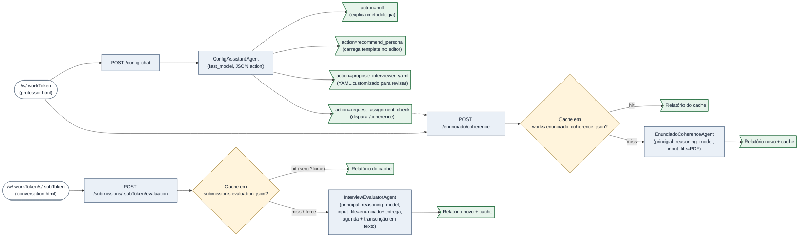

# Arquitetura — ciclo do `/chat` e mapa de prompts

Após a reforma do super-orquestrador (merge `dae5780`), o ciclo de uma resposta
do aluno ao próximo passo do entrevistador deixou de ter triagem×3 +
sufficiency + relevance em paralelo. Hoje, **uma única chamada de raciocínio
por turno** (SuperOrchestratorAgent) decide tudo: continuar, fazer follow-up,
abrir modal de meta-pergunta, mostrar dica, finalizar. O código vira
despachante; agente decide.

> **Como abrir os arquivos no clique**
>
> Pré-requisito: extensão **Markdown Preview Mermaid Support** (`bierner.markdown-mermaid`) instalada. Abra esta página com `Ctrl+Shift+V`.
>
> Os nós de agente clicam direto na linha do `systemPrompt` (não no topo do arquivo). Se o seu preview bloquear o esquema `vscode://` (alguns o fazem por segurança), use a **tabela de navegação** abaixo do diagrama.


## Tabela de navegação — código e prompt lado a lado

Use esta tabela se o clique no SVG não abrir nada. Cada linha tem o **bloco de código** e o **prompt** correspondente quando há.

| Bloco | Código | Prompt enviado à LLM |
|---|---|---|
| Handler do `/upload` | [routes/interview.js — /upload](../routes/interview.js) | — |
| Preparação em background (`startInterviewPreparation`) | [lib/sessionLifecycle.js — startInterviewPreparation](../lib/sessionLifecycle.js) | ver agentes correspondentes |
| `PrepBuilderAgent.analyzeWork` (1ª chamada da prep, analisa trabalho + enunciado) | [agents/PrepBuilderAgent.js — analyzeWork](../agents/PrepBuilderAgent.js) | preâmbulo (`orchestrator_only`) + `analyzeSystemBody` + agenda |
| `PrepBuilderAgent.buildPlan` (2ª chamada, recebe análise) | [agents/PrepBuilderAgent.js — buildPlan](../agents/PrepBuilderAgent.js) | preâmbulo (`orchestrator_only`) + [interview_prompt_template.txt](../config/interview_prompt_template.txt) renderizado + análise prévia |
| `createVectorStoreWithFiles` (aluno + enunciado, expandido na reforma) | [lib/sessionLifecycle.js:59](../lib/sessionLifecycle.js#L59) | — |
| Handler do `/chat` | [routes/interview.js — /chat](../routes/interview.js) | — |
| Pré-gate de inteligibilidade (algoritmo puro decide; `AudioIntelligibilityAgent` só fraseia) | [lib/audioIntelligibility.js](../lib/audioIntelligibility.js) + [agents/AudioIntelligibilityAgent.js](../agents/AudioIntelligibilityAgent.js) | preâmbulo + `systemPromptBody` + agenda + transcrição + trechos detectados |
| `IntroductionAgent` (3 beats: ask_name / present_self / begin) | [agents/IntroductionAgent.js](../agents/IntroductionAgent.js) | [bodyFor :39](../agents/IntroductionAgent.js#L39) + persona + agenda + histórico do intro |
| `SuperOrchestratorAgent` (UMA chamada por turno na fase interviewing) | [agents/SuperOrchestratorAgent.js](../agents/SuperOrchestratorAgent.js) | preâmbulo (`student_via_interviewer_voice`) + `systemPromptBody` + agenda + análise + plano + memory + histórico (via Conversations API) + última mensagem |
| Schema da ação do super-orquestrador | [lib/superOrchestrator/actionSchema.js](../lib/superOrchestrator/actionSchema.js) | descrição embutida no prompt do agente |
| Despachante por `action.kind` em `/chat` | [routes/interview.js — bloco SUPER-ORQUESTRADOR](../routes/interview.js) | — |
| Guardrails de cap e finalize precoce (derivados de `works.question_count`: cap = nº×3, piso = ⌈nº/2⌉) | [routes/interview.js — maxTurnsFor / minTurnsBeforeFinalizeFor](../routes/interview.js) | — |
| Sortição da persona | [lib/personas.js](../lib/personas.js) | — |
| `turnFromPlanQuestion` | [lib/conversationUtils.js](../lib/conversationUtils.js) | — |
| Persistência do log | [lib/conversationUtils.js — persistConversationLog](../lib/conversationUtils.js) | — |
| Endpoint que serve o log pro professor | [routes/work.js — /conversation](../routes/work.js) | — |
| SSE em `/chat` áudio interviewing (sinal `responding` em tempo real) | [routes/interview.js — useSSE / sendFinal](../routes/interview.js) + [agents/SuperOrchestratorAgent.js — onFirstDelta](../agents/SuperOrchestratorAgent.js) | — |

## Caminhos não cobertos pelo diagrama

| Bloco | Código | Prompt enviado à LLM |
|---|---|---|
| `INTERVIEWER_ADAPT_INSTRUCTIONS` (botão "Adaptar ao enunciado") | [routes/work.js](../routes/work.js) | string literal usada como `instructions` na chamada da Responses API |
| `ConfigAssistantAgent` (chat do assistente de configuração, em `/w/:workToken/config-chat`) | [agents/ConfigAssistantAgent.js](../agents/ConfigAssistantAgent.js) | preâmbulo + `systemPromptBody` |
| `EnunciadoCoherenceAgent` (avalia adequação do enunciado, em `/w/:workToken/enunciado/coherence`) | [agents/EnunciadoCoherenceAgent.js](../agents/EnunciadoCoherenceAgent.js) | preâmbulo + `systemPromptBody` |
| `InterviewEvaluatorAgent` (avalia a entrevista sob a perspectiva do entrevistador, em `/w/:workToken/submissions/:subToken/evaluation`) | [agents/InterviewEvaluatorAgent.js](../agents/InterviewEvaluatorAgent.js#L162) | preâmbulo (`professor_via_ui`) + `systemPromptBody` (inclui `EXTEMPORANEOUS_ANSWER_PRINCIPLE`) + agenda + transcrição serializada com métricas de forma/entrega por turno ([lib/deliverySignals.js](../lib/deliverySignals.js), compartilhado com o forense `scripts/detect-ai-answers.mjs`); PDFs (enunciado + entrega) via `input_file` |
| Retomada de sessão após restart (`/start`: hidrata do BD + valida recursos OpenAI + rebuild quando necessário) | [lib/sessionLifecycle.js — initOrResumeSession / validateResources / rebuildSession](../lib/sessionLifecycle.js), [lib/sessionState.js](../lib/sessionState.js) | nenhum LLM novo — rebuild reusa `work_analysis` (e `interview_plan`) salvos no `runtime_state_json` |

## Configuração do trabalho (página do professor)

Fluxo independente do ciclo `/chat` do aluno — não foi tocado pela reforma do
super-orquestrador. O professor abre `/w/:workToken`, edita os campos
manualmente E/OU consulta um assistente conversacional que sugere personas,
explica metodologia e despacha avaliação de coerência do enunciado. O
assistente NUNCA salva — só propõe; o professor aplica via UI.



Características:

- **Sem persistência de chat**: histórico vive só na aba do navegador; cada turno o cliente reenvia o histórico inteiro (sem Conversations API, ver CLAUDE.md).
- **Cache de coerência**: `works.enunciado_coherence_json` guarda o último relatório do `EnunciadoCoherenceAgent`. É invalidado automaticamente quando o PDF do enunciado é substituído (`POST /enunciado` chama `db.clearCoherenceCache`).
- **Estado injetado no system prompt**: o `ConfigAssistantAgent` recebe um `state_block` com nome do trabalho, presença do PDF, último diagnóstico de coerência e identidade do template salvo.
- **Validação rígida das ações**: ações com filename de persona inválido, YAML vazio ou `based_on` desconhecido são rejeitadas no agente antes de chegarem à UI.

## Índice completo de prompts

Lugar único onde encontrar **todo prompt enviado à LLM** no sistema:

1. **Templates `.txt`** ([config/](../config/)):
   - [interview_prompt_template.txt](../config/interview_prompt_template.txt) — renderizado por `PrepBuilderAgent.buildPlan` para gerar o plano de entrevista.
   - [interviewer_agenda_template.txt](../config/interviewer_agenda_template.txt) — bloco de agenda compartilhado por todos os agentes que operam no contexto da entrevista.
   - [narrator_intro.txt](../config/narrator_intro.txt) — script fixo lido por [lib/narrator.js](../lib/narrator.js) e enviado à TTS (não à LLM de raciocínio); produz o áudio do "orientador" que toca antes do entrevistador no modo áudio.
   - [student_instructions.html](../static/student_instructions.html) — instruções mostradas ao aluno no modal "Instruções" (não vai à LLM, mas é conteúdo editável).
2. **`systemPromptBody` + preâmbulo padronizado em classes de agente** ([agents/](../agents/)):
    Todo agente compõe seu system prompt como `renderAgentPreamble({audience, interactionMode, studentName})` + body específico. O preâmbulo enquadra a cena (SuperTA, identidade dupla, audience, modo, nome do aluno quando disponível). Ver [lib/agentPreamble.js](../lib/agentPreamble.js).

   - **`EXTEMPORANEOUS_ANSWER_PRINCIPLE`** (constante exportada em [lib/agentPreamble.js](../lib/agentPreamble.js)) — princípio mode-independente "a pergunta deve pressupor resposta formulável de cabeça, assumindo domínio do trabalho". Fonte única, injetada IDENTICAMENTE nos dois pontos que emitem perguntas: o template do plano (via placeholder `{{extemporaneous_principle}}` em [interview_prompt_template.txt](../config/interview_prompt_template.txt), preenchido por [lib/interviewPrompt.js](../lib/interviewPrompt.js)) e o `systemPromptBody` do [SuperOrchestratorAgent.js](../agents/SuperOrchestratorAgent.js).

   **Conjunto ativo após a reforma do super-orquestrador:**
   - [PrepBuilderAgent.js](../agents/PrepBuilderAgent.js) — modelo: `principal_reasoning_model`, audience: `orchestrator_only`. Duas chamadas serializadas em `/upload`: `analyzeWork` (análise do trabalho) → `buildPlan` (plano de 10 perguntas informado pela análise).
   - [IntroductionAgent.js](../agents/IntroductionAgent.js) — modelo: `fast_model`, audience: `student_via_interviewer_voice`. Roteiro determinístico de 3 beats: `ask_name` / `present_self` / `begin`.
   - [AudioIntelligibilityAgent.js](../agents/AudioIntelligibilityAgent.js) — modelo: `fast_model`, audience: `student_via_interviewer_voice`. Pré-gate de áudio: o algoritmo em [lib/audioIntelligibility.js](../lib/audioIntelligibility.js) decide se vai gateiar (sobre logprobs do STT); o agente apenas fraseia o pedido de repetição ou a fala de give_up.
   - [SuperOrchestratorAgent.js](../agents/SuperOrchestratorAgent.js) — modelo: `principal_reasoning_model`, audience: `student_via_interviewer_voice`. **UMA chamada por turno** na fase `interviewing`. Devolve uma `action` no schema definido em [lib/superOrchestrator/actionSchema.js](../lib/superOrchestrator/actionSchema.js). Mantém estado entre turnos via `memory` em `runtime_state.super_orchestrator.memory`. Em modo áudio, roda com `stream: true` para sinalizar `responding` ao frontend via SSE no primeiro token de texto.
   - [ConfigAssistantAgent.js](../agents/ConfigAssistantAgent.js) — modelo: `fast_model`, audience: `professor_via_ui` (chat do assistente de configuração na página do professor).
   - [EnunciadoCoherenceAgent.js](../agents/EnunciadoCoherenceAgent.js) — modelo: `principal_reasoning_model`, audience: `professor_via_ui` (avalia adequação do enunciado, recebe PDF via `input_file`).
   - [InterviewEvaluatorAgent.js](../agents/InterviewEvaluatorAgent.js) — modelo: `principal_reasoning_model`, audience: `professor_via_ui`. Avalia a entrevista realizada sob a perspectiva do entrevistador (rota `/w/:workToken/submissions/:subToken/evaluation`, botão na página da conversa). Recebe os dois PDFs via `input_file`, a agenda renderizada e a transcrição serializada em texto com métricas de FORMA/ENTREGA por turno (latência, tempo até começar a falar, palavras/s, caracteres/s, disfluências, registro escrito, polimento — [lib/deliverySignals.js](../lib/deliverySignals.js), mesma fonte de heurísticas do forense `scripts/detect-ai-answers.mjs`; nunca os bytes de áudio); injeta o `EXTEMPORANEOUS_ANSWER_PRINCIPLE` para não punir respostas de direção+mecanismo+ordem de grandeza. Avaliação holística: conteúdo decide o mérito por pergunta; forma alimenta o campo `delivery` e corrobora sinais de autoria. Resultado cacheado em `submissions.evaluation_json`.
3. **Strings inline em `routes/`**:
   - [INTERVIEWER_ADAPT_INSTRUCTIONS](../routes/work.js) — instruções para "Adaptar ao enunciado".

## Convenção do esquema `vscode://`

Formato no Windows:

```
vscode://file/<drive>:/<caminho-com-barras-pra-frente>:<linha>
```

Exemplo: `vscode://file/c:/Users/glads/src/super-ta/routes/interview.js:474`. Sem `:linha` no final, abre na linha 1.
