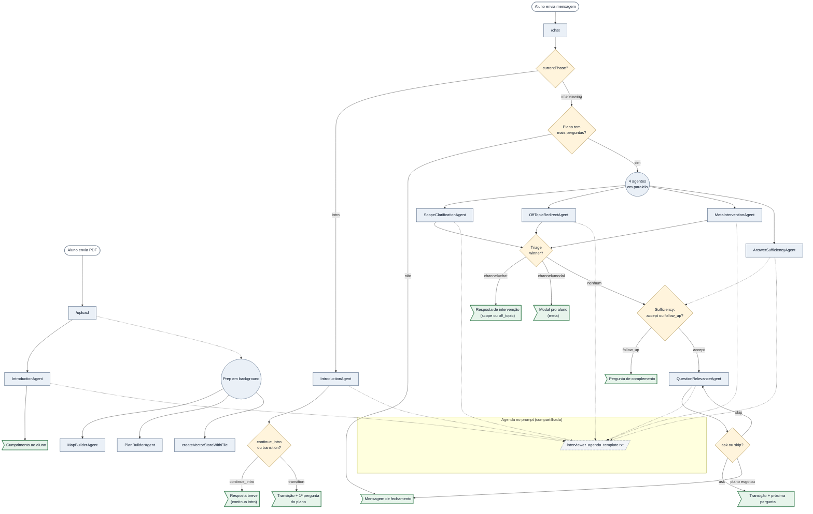
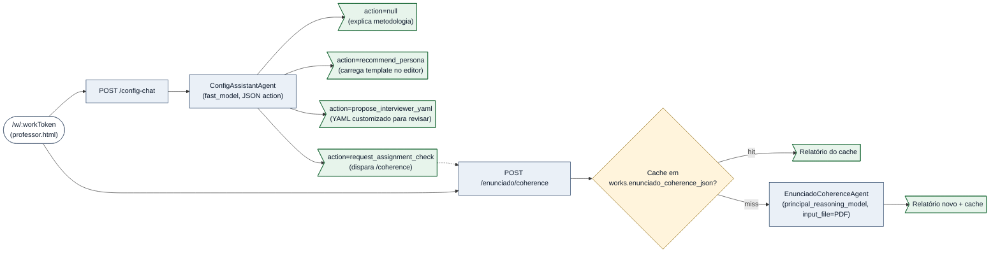

# Arquitetura — ciclo do `/chat` e mapa de prompts

Diagrama do que acontece entre uma resposta do aluno e a próxima pergunta do plano:
triagem em paralelo (3 agentes), agente de relevância (loop de skip) e progressão.

> **Como abrir os arquivos no clique**
>
> Pré-requisito: extensão **Markdown Preview Mermaid Support** (`bierner.markdown-mermaid`) instalada. Abra esta página com `Ctrl+Shift+V`.
>
> No diagrama, **cada nó de agente clica direto na linha do `systemPrompt`** (não no topo do arquivo). Os nós de fluxo clicam na linha do handler/função correspondente. O nó "Templates compartilhados" clica nos templates `.txt` que entram na composição dos prompts dos agentes de triagem e do de relevância. Se o seu preview bloquear o esquema `vscode://` (alguns o fazem por segurança), use a **tabela de navegação** abaixo do diagrama — links markdown puros que sempre funcionam.



## Tabela de navegação — código e prompt lado a lado

Use esta tabela se o clique no SVG não abrir nada. Cada linha tem o **bloco de código** e o **prompt** correspondente quando há.

| Bloco | Código | Prompt enviado à LLM |
|---|---|---|
| Handler do `/upload` | [server.js:864](../server.js#L864) | — |
| Preparação em background (MapBuilder + PlanBuilder + vector store, em paralelo) | [server.js — startInterviewPreparation](../server.js) | ver agentes correspondentes |
| `MapBuilderAgent` (DocumentMap, chamado em paralelo na prep) | [agents/MapBuilderAgent.js](../agents/MapBuilderAgent.js) | preâmbulo (`orchestrator_only`) + `systemPromptBody` |
| `PlanBuilderAgent` (plano de N perguntas, chamado em paralelo na prep) | [agents/PlanBuilderAgent.js](../agents/PlanBuilderAgent.js) | preâmbulo (`orchestrator_only`) + [interview_prompt_template.txt](../config/interview_prompt_template.txt) renderizado |
| `IntroductionAgent` (fast, fase social) | [agents/IntroductionAgent.js](../agents/IntroductionAgent.js) | [systemPrompt :30](../agents/IntroductionAgent.js#L30) + persona + agenda + histórico do intro |
| Sortição da persona | [lib/personas.js](../lib/personas.js) | — |
| Handler do `/chat` | [server.js:1014](../server.js#L1014) | — |
| Gate por `currentPhase` (intro vs interviewing) | [server.js:1044](../server.js#L1044) | — |
| Ramo `continue_intro` (decisão do agente) | [server.js:1081](../server.js#L1081) | — |
| Ramo `transition` (await prep + turno 0) | [server.js:1101](../server.js#L1101) | — |
| Montagem transição + 1ª pergunta do plano | [server.js:1124](../server.js#L1124) | — |
| Lançamento dos 4 agentes em paralelo | [server.js:1163](../server.js#L1163) | — |
| `ScopeClarificationAgent` (fast) | [agents/ScopeClarificationAgent.js](../agents/ScopeClarificationAgent.js) | [systemPrompt :23](../agents/ScopeClarificationAgent.js#L23) + agenda + último turno |
| `OffTopicRedirectAgent` (fast) | [agents/OffTopicRedirectAgent.js](../agents/OffTopicRedirectAgent.js) | [systemPrompt :20](../agents/OffTopicRedirectAgent.js#L20) + agenda + último turno |
| `MetaInterventionAgent` (fast) | [agents/MetaInterventionAgent.js](../agents/MetaInterventionAgent.js) | [systemPrompt :24](../agents/MetaInterventionAgent.js#L24) + agenda + último turno |
| `AnswerSufficiencyAgent` (reasoning, abortável; gera transition_phrase quando accept) | [agents/AnswerSufficiencyAgent.js](../agents/AnswerSufficiencyAgent.js) | [systemPrompt :33](../agents/AnswerSufficiencyAgent.js#L33) + agenda + pergunta do turno + conversa completa + última mensagem (RAG via vector store) |
| Decisão do vencedor (`pickTriageWinner`) | [server.js:273](../server.js#L273) | — |
| Await do sufficiency e ramo follow_up | [server.js:1278](../server.js#L1278) | — |
| Captura da `transition_phrase` (caminho accept) | [server.js:1322](../server.js#L1322) | — |
| `QuestionRelevanceAgent` (fast) | [agents/QuestionRelevanceAgent.js](../agents/QuestionRelevanceAgent.js) | [systemPrompt :23](../agents/QuestionRelevanceAgent.js#L23) + agenda + conversa completa + candidata |
| Skip-loop de relevância | [server.js:1357](../server.js#L1357) | — |
| Montagem `transition + próxima pergunta` (ramo accept) | [server.js:1399](../server.js#L1399) | — |
| `turnFromPlanQuestion` | [server.js:187](../server.js#L187) | — |
| Serializer do log | [server.js:207](../server.js#L207) | — |
| Persistência do log | [lib/conversationLog.js](../lib/conversationLog.js) | — |
| Endpoint que serve o log pro professor | [server.js:592](../server.js#L592) | — |
| Mensagem de fechamento (sentinel) | [server.js:1406](../server.js#L1406) | string literal — não vai à LLM |

## Caminhos não cobertos pelo diagrama

| Bloco | Código | Prompt enviado à LLM |
|---|---|---|
| `MapBuilderAgent` (chamado em `/upload`, parte da prep paralela) | [agents/MapBuilderAgent.js](../agents/MapBuilderAgent.js) | preâmbulo (`orchestrator_only`) + `systemPromptBody` |
| `PlanBuilderAgent` (chamado em `/upload`, parte da prep paralela — gera o plano de entrevista) | [agents/PlanBuilderAgent.js](../agents/PlanBuilderAgent.js) | preâmbulo (`orchestrator_only`) + [interview_prompt_template.txt](../config/interview_prompt_template.txt) renderizado via [lib/interviewPrompt.js](../lib/interviewPrompt.js) |
| `ComprehensionEvaluatorAgent` (chamado em `/finalize`) | [agents/ComprehensionEvaluatorAgent.js](../agents/ComprehensionEvaluatorAgent.js) | [systemPrompt :23](../agents/ComprehensionEvaluatorAgent.js#L23) |
| `ClarificationEvaluatorAgent` (chamado em `/finalize`) | [agents/ClarificationEvaluatorAgent.js](../agents/ClarificationEvaluatorAgent.js) | [systemPrompt :23](../agents/ClarificationEvaluatorAgent.js#L23) |
| `INTERVIEWER_ADAPT_INSTRUCTIONS` (botão "Adaptar ao enunciado") | [server.js:660](../server.js#L660) | string literal usada como `instructions` na chamada da Responses API |
| Base TA (carregada por `loadSystemPrompt`) | [server.js:88](../server.js#L88) | [config/system_prompt.txt](../config/system_prompt.txt) |
| `/finalize` (gera relatório) | [server.js:1192](../server.js#L1192) | strings inline na função `calculateRubricScores` (a ser extraídas, ver TODO abaixo) |
| `ConfigAssistantAgent` (chat do assistente de configuração, chamado em `/w/:workToken/config-chat`) | [agents/ConfigAssistantAgent.js](../agents/ConfigAssistantAgent.js) | [systemPrompt :31](../agents/ConfigAssistantAgent.js#L31) |
| `EnunciadoCoherenceAgent` (avalia adequação do enunciado, chamado em `/w/:workToken/enunciado/coherence`) | [agents/EnunciadoCoherenceAgent.js](../agents/EnunciadoCoherenceAgent.js) | [systemPrompt :40](../agents/EnunciadoCoherenceAgent.js#L40) |
| Retomada de sessão após restart (`/start`: hidrata do BD + valida recursos OpenAI + rebuild quando necessário) | [server.js — initOrResumeSession / validateResources / rebuildSession](../server.js), [lib/sessionState.js](../lib/sessionState.js) | nenhum LLM novo — rebuild reusa `document_map` salvo no `runtime_state_json` |

## Configuração do trabalho (página do professor)

Fluxo independente do ciclo `/chat` do aluno. O professor abre `/w/:workToken`,
edita os campos manualmente E/OU consulta um assistente conversacional que
sugere personas, explica metodologia e despacha avaliação de coerência do
enunciado. O assistente NUNCA salva — só propõe; o professor aplica via UI.



Características:

- **Sem persistência de chat**: histórico vive só na aba do navegador; cada turno o cliente reenvia o histórico inteiro (sem Conversations API, ver CLAUDE.md).
- **Cache de coerência**: `works.enunciado_coherence_json` guarda o último relatório do `EnunciadoCoherenceAgent`. É invalidado automaticamente quando o PDF do enunciado é substituído (`POST /enunciado` chama `db.clearCoherenceCache`).
- **Estado injetado no system prompt**: o `ConfigAssistantAgent` recebe um `state_block` com nome do trabalho, presença do PDF, último diagnóstico de coerência e identidade do template salvo. Construído por `buildConfigStateBlock` em [server.js](../server.js).
- **Validação rígida das ações**: ações com filename de persona inválido, YAML vazio ou `based_on` desconhecido são rejeitadas no agente antes de chegarem à UI.

## Índice completo de prompts

Lugar único onde encontrar **todo prompt enviado à LLM** no sistema:

1. **Templates `.txt`** ([config/](../config/)):
   - [system_prompt.txt](../config/system_prompt.txt) — base TA.
   - [interview_prompt_template.txt](../config/interview_prompt_template.txt) — renderizado pelo `PlanBuilderAgent` para gerar o plano de entrevista.
   - [interviewer_agenda_template.txt](../config/interviewer_agenda_template.txt) — bloco de agenda compartilhado por triagem e relevância.
2. **`systemPromptBody` + preâmbulo padronizado em classes de agente** ([agents/](../agents/)):
    Todo agente compõe seu system prompt como `renderAgentPreamble({audience, interactionMode})` + `this.systemPromptBody`. O preâmbulo enquadra a cena (SuperTA, identidade dupla, audience, modo). Ver [lib/agentPreamble.js](../lib/agentPreamble.js).

   - [MapBuilderAgent.js](../agents/MapBuilderAgent.js) — modelo: `principal_reasoning_model`, audience: `orchestrator_only`
   - [PlanBuilderAgent.js](../agents/PlanBuilderAgent.js) — modelo: `principal_reasoning_model`, audience: `orchestrator_only`, body é o template `interview_prompt_template.txt` renderizado por chamada
   - [ComprehensionEvaluatorAgent.js](../agents/ComprehensionEvaluatorAgent.js) — modelo: `principal_reasoning_model`, audience: `orchestrator_only`
   - [ClarificationEvaluatorAgent.js](../agents/ClarificationEvaluatorAgent.js) — modelo: `principal_reasoning_model`, audience: `orchestrator_only`
   - [ScopeClarificationAgent.js](../agents/ScopeClarificationAgent.js) — modelo: `fast_model`, audience: `student_via_interviewer_voice`
   - [OffTopicRedirectAgent.js](../agents/OffTopicRedirectAgent.js) — modelo: `fast_model`, audience: `student_via_interviewer_voice`
   - [MetaInterventionAgent.js](../agents/MetaInterventionAgent.js) — modelo: `fast_model`, audience: `student_via_interviewer_voice`
   - [QuestionRelevanceAgent.js](../agents/QuestionRelevanceAgent.js) — modelo: `fast_model`, audience: `orchestrator_only`
   - [AnswerSufficiencyAgent.js](../agents/AnswerSufficiencyAgent.js) — modelo: `principal_reasoning_model`, audience: `student_via_interviewer_voice` (abortável via `signal`)
   - [IntroductionAgent.js](../agents/IntroductionAgent.js) — modelo: `fast_model`, audience: `student_via_interviewer_voice` (fase social, persona em [lib/personas.js](../lib/personas.js))
   - [ConfigAssistantAgent.js](../agents/ConfigAssistantAgent.js) — modelo: `fast_model`, audience: `professor_via_ui` (chat do assistente de configuração na página do professor)
   - [EnunciadoCoherenceAgent.js](../agents/EnunciadoCoherenceAgent.js) — modelo: `principal_reasoning_model`, audience: `professor_via_ui` (avalia adequação do enunciado ao processo, recebe PDF via `input_file`)
3. **Strings inline em `server.js`**:
   - [INTERVIEWER_ADAPT_INSTRUCTIONS — linha 660](../server.js#L660) — instruções para "Adaptar ao enunciado".
   - **TODO**: as instruções de C2/C3 dentro de `calculateRubricScores` ainda são strings inline. Quando extraídas para um arquivo dedicado, atualizar este índice.

## Convenção do esquema `vscode://`

Formato no Windows:

```
vscode://file/<drive>:/<caminho-com-barras-pra-frente>:<linha>
```

Exemplo: `vscode://file/c:/Users/glads/src/super-ta/server.js:973`. Sem `:linha` no final, abre na linha 1.
