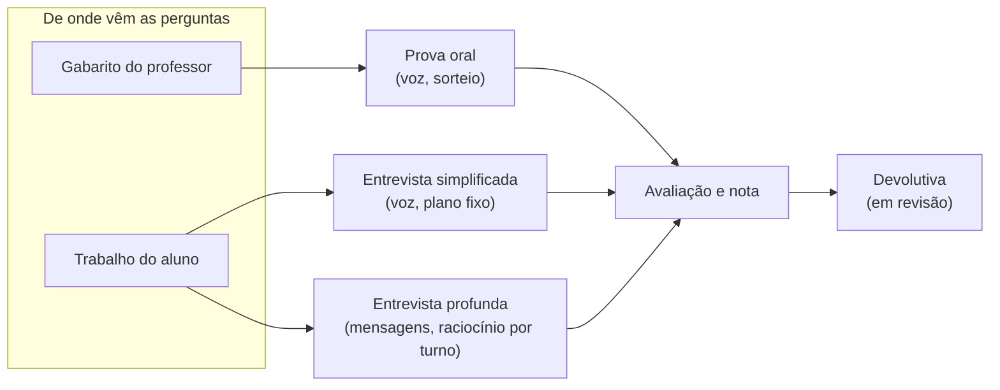

# Capacidades do ORATIA

O que o produto faz, em linguagem de negócio. **Uma página por capacidade**, e
cada página diz para quem serve, o que o professor configura, o que o aluno
vive, o que sai no fim e — importante — **o que aquela capacidade deliberadamente
não faz**.

Esta é a camada que responde "se eu mudar isso, o que é afetado?". Se uma mudança
altera qualquer resposta de alguma página aqui, ela é uma mudança de produto,
não de implementação — e a página tem que ser atualizada no mesmo PR.

## Mapa

| Capacidade | Uma frase | Estado |
|---|---|---|
| [Configuração do trabalho](configuracao-do-trabalho.md) | O professor descreve o que quer avaliar e o sistema prepara a arguição. | em produção |
| [Prova oral](prova-oral.md) | Arguição falada contra um gabarito do professor, com perguntas sorteadas. | em produção |
| [Entrevista simplificada](entrevista-simplificada.md) | Arguição falada sobre o trabalho do aluno, com perguntas preparadas na hora. | em produção |
| [Entrevista profunda](entrevista-profunda.md) | Arguição que raciocina a cada turno e aprofunda quando a resposta não fecha. | em produção |
| [Fiscalização por vídeo](fiscalizacao-por-video.md) | Câmera aberta e obrigatória durante a arguição, com sinais para revisão humana. | em produção |
| [Avaliação e nota](avaliacao-e-nota.md) | Leitura interna do desempenho e nota por rubrica, ambas revisáveis. | em produção |
| [Devolutiva ao aluno](devolutiva.md) | Texto formativo derivado da avaliação, publicado quando o professor decide. | **em revisão** |
| [Controle de uso e custo](controle-de-uso-e-custo.md) | Teto de gasto por trabalho e cotas por unidade, com reserva e devolução. | em produção |
| [Camada institucional](camada-institucional.md) | Unidades em árvore, papéis por unidade e login multi-instituição. | parcial |
| [Cenários multiagente](cenarios-multiagente.md) | O aluno interage com várias personas numa sequência de encontros. | experimental |

## Como as três formas de arguição se relacionam

As três compartilham o mesmo motor de evidência: o que muda é **de onde vêm as
perguntas** e **quanto o sistema raciocina durante a conversa**.

Uma consequência prática: **mudar o motor de avaliação afeta as três**; mudar a
condução da conversa afeta só uma. É a distinção que costuma faltar quando se
pede uma mudança "na entrevista".

## Modelo de domínio (os substantivos)

Vocabulário compartilhado — vale para conversa, código e banco:

- **Trabalho** (`works`) — a unidade que o professor cria e configura. Tem um
  tipo (`kind`) e, no caso de entrevista, uma variante (`interview_variant`).
- **Envio / submissão** (`submissions`) — a participação de **um** aluno num
  trabalho. É o que carrega o link individual, a conversa, a avaliação e a nota.
- **Turno** — uma pergunta do arguidor e a resposta do aluno, com eventuais
  aprofundamentos.
- **Rubrica** — os critérios e pesos com que a nota é calculada.
- **Persona / entrevistador** — o caráter configurado que conduz a arguição.
- **Unidade** — nó da árvore institucional (instituição, escola, curso, turma).
